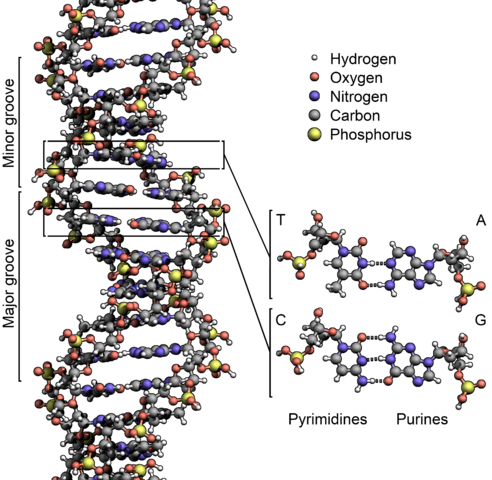

```{title}
Biology
```

```{toc}
```

# Introduction

Biology is defined as the study of life / living things. A `{bm} living/\b(living|life)\b/i` thing is defined as anything that converts energy from one form to another, while using that energy to grow, change, and reproduce.

```{note}
Primary source for these notes is Khan Academy's HS Biology course, with additional information from Wikipedia and other sources.
```

# Scientific Method

The `{bm} scientific method` is the standard guideline for discovery and experimentation in the sciences (chemistry, physics, biology, etc..) The `{bm-ri} basic` steps are...

1. Observe.
2. Ask a question about the observation.
3. Make a guess that answers the question (hypothesis).
4. Test the guess to see if it's correct (experiment).
5. Refine and iterate.

The last step (refine and iterate) just means that you do it all over again but make changes based on the things you learned from your experiment. For example, ...

* do additional experiments to dig into some aspect deeper.
* if the hypothesis wasn't supported by the experiment, maybe come up with a new hypothesis.

## Hypothesis

The scientific method revolves around making an observation and coming up with a testable explanation for that observation -- called a `{bm} hypothesis`. If the explanation isn't *testable*, you can't consider it a hypothesis. For example, a good hypothesis may be that increased sun exposure leads to an increased risk of skin cancer because it's something you can test. A bad explanation may be that exposure to centaurs increase the risk of skin cancer because centaurs don't exist (and as such the hypothesis can't be tested).

```{note}
The material mentions that for a hypothesis to be testable, you should be able to come up with an experiment that shows that its false -- it's falsifiable. How you word your hypothesis is typically what determines if it's testable/falsifiable -- when you read the hypothesis, what defines a failure?
```

```{note}
A hypothesis and a theory are different things. Hypothesis is a potential answer for a specific problem. A theory provides a potential framework for a much broader class of problems based on supporting evidence. The example given by the material: "The toaster won't toast because the electrical outlet is broken" is a hypothesis, whereas "Electrical appliances need a source of electricity in order to run" is closer to a theory.
```

## Experiment

Once you have a hypothesis, you design an `{bm} experiment` to test it. In the case of our sun exposure leads to increased risk of skin cancer hypothesis, an experiment may be to expose skin cells to UV rays in amounts equivalent to that given off by the sun and then check to see if those cells have been damaged (compared to a control group of skin cells that you haven't exposed to UV rays).

What makes a good experiment?

* `{bm} Control group` - A control group contains a set of entities that don't get treatment, but those entities are equal to the entities in the `{bm} experimental group` (as much as possible) and exposed to the same conditions as the entities in the experimental group (as much as possible). This helps eliminate outside factors/variables from tainting the results of an experiment -- it's a `{bm} controlled experiment` . For example, in the skin cancer example experiment described above, a control group may be a set of skin cells that sit along side the experimental group skin cells that get treated with UV rays -- the cells in the control group shouldn't show signs of damage while the cells in the experimental group should.
* `{bm} Random selection` - The entities being used for an experiment must be randomly selected (both for the control group and the experimental group). Random selection helps minimize skewed results introduced from bias during the selection process. For example, the individual responsible for selecting candidates for drug trials may choose to disproportionately select people of a certain race (e.g. racism).
* `{bm} Double blind` - The people conducting the experiment may implicitly/explicitly taint the experiment via their own bias. For example, if the experiment involves an interviewer asking a set of questions, the interviewer may subconsciously change the pronunciations of words if he/she knows that the interviewee is in the control group, there by effecting the answer given by the interviewee.
* **Statistical significance** - The results between the control group and the experimental group needs to be large enough to support your hypothesis. A small difference could mean that outcome was due to variance in the selected groups (there's a branch of statistics that deals with this).
* **Replicable** - Others should be able to repeat the same experiment and (hopefully) come to the same result. If they don't, it could be that something was wrong with your experiment or the entities being tested had some underlying difference that changed the result.

```{note}
There's always at least one control group in any experiment to provide a baseline. There's no limit to the number of experimental groups -- each group may have a slightly different type/amount of treatment applied.
```

```{note}
Because things are so wishy-washy/not-exacty in biology, it's typical for an experiments to be repeated multiple times and to have a large sample size -- the larger our sample sizes and the more times we conduct the experiment, the more we can be confident of our result. What do I mean by wishy-washy? Genetic variation between samples may result in different types/levels of responses. For example, people with a certain gene may respond quicker to certain drugs than people who don't produce that gene.
```

Other terminology around the scientific method...

* `{bm} treatment` - The application of the test given to the experimental group(s) but not the control group.
* `{bm} independent variable` - An independent variable is `{bm-ri} basically` the treatment you apply -- you can think of it as the input knob you control for your experiment. For example, in the skin cancer experiment, the independent variable would be the amount of artificial UV rays you apply to the skin cells.
* `{bm} dependent variable` - A dependent variable is a response you measure after applying the treatment -- you can think of it as the output from your experiment. For example, in the skin cancer experiment, the dependent variable might be a measurement of how different the cells are functioning (e.g. a cell with damaged DNA may produce different kinds / amounts of tRNA molecules -- something you can measure).
* **data** - This is exactly what you think it is -- measurements/observations made during the experiment.
* `{bm} placebo effect/(placebo effect|placebo)/i` - When experimenting on people, there's a phenomenon called the placebo effect: if someone takes something that shouldn't help them but are under the impression it will help them, it often times will help them, just from the psychological effect alone.

```{note}
You can have more than one independent variable if you follow specific guidelines and are experienced enough, but the general rule of thumb is to have only 1 independent variable just because it makes things much simpler to analyze/interpret.
```

# Chemistry

An **element** is matter that cannot be broken down any further by chemical reaction -- it's a substance made entirely out of one type of `{bm} atom`. Each element/atom has a specific set of properties that defines how it acts/reacts (e.g. weight, colour, how light reflects, etc..).

Examples of elements/atoms:
* Gold - Yellow coloured, reflective, malleable, and corrosion-resistant.
* Lead - Blue/white coloured, relatively soft, malleable.
* Carbon Silver/gray coloured, reflective, easily oxidizes/corrodes.

Examples of non-elements:
* Salt water - Mixture of sodium and water.
* Water - Water can be further broken down to the elements hydrogen and oxygen.
* Glucose - Glucose can be further broken down to the elements carbon, hydrogen, and oxygen.


The building blocks of atoms are `{bm} protons`, `{bm} neutrons`, and `{bm} electrons`. Protons and neutrons form the nucleus of the atom while electrons jump around outside of the nucleus. Protons and electrons are attracted to each other -- protons are positively charged while electrons are negatively charged. Although, protons and electrons never fully meet (electrons are always buzzing/hovering around the outside of the nucleus where the protons are).

The configuration of an atom (protons/neutrons/electrons) is what allows us to predicate how one element may react to another element. For example, certain elements may attract, repel, bond, swipe electrons, etc..

The number of protons are what defines the type of atom/element. For example, hydrogen has 1 proton, helium as 2, lithium has 3, etc.. The number of neutrons and electrons can change without changing the type of element as long as the number of protons remain the same.

The periodic table below orders elements/atoms by the number of protons (also called the `{bm} atomic number`)...


```{note}
A different number of neutrons = different version of the same element. For example, Carbon-12 (6 neutrons) and Carbon-13 (7 neutrons).
```

When atoms bind together, they form a `{bm} molecule`. Each type of molecule has the same configuration of atoms -- same atoms in the same numbers, structured/shaped similarly. For example, a water molecule is made up of 2 hydrogen atoms and 1 oxygen atom binding together in a house-roof shape...


```{note}
As far as I can tell, the atoms will always bind in the same way. You can't ever have a molecule that has the same types of atoms in the same numbers but with a different structure.
```

A `{bm} monomer` is a special designation for atoms/molecules that are able to join with other monomers to create even larger molecules. The process of joining is called `{bm} polymerization/(polymerization|polymerize)/i` and the resulting molecule is called a `{bm} polymer`.

```{dot}
digraph {
  rankdir=LR;
  "monomer"->"polymer" [taillabel="1..*", headlabel="1", arrowhead=none];
}
```

If the monomers that make up a polymer are all the same, the polymer is called a `{bm} homopolymer`. Otherwise, it's called a `{bm} heteropolymer` / `{bm} copolymer`.

For example, the glucose molecule is a monomer. It can combine with other glucose molecules to create the glycogen molecule, which is a polymer / homopolymer. Other examples of polymers (according to Wikipedia): amino acids and nucleotides (DNA).

```{note}
There are probably special properties to monomers that allow them to chain up. The Wikipedia page talks about a feature of monomers being a "carbon double bond" which is what allows them to form polymers.
```

Polymers are often referred to as `{bm} macromolecule`s -- molecules that have a very large number of atoms.

An `{bm} ion/\b(ion)\b/i` is a charged atom or molecule. A charged atom/molecule just means that it has an unequal number of protons and electrons:
* if protons > electrons (more protons), it's called a `{bm} positively charged/(positive charge|positive-charge|positively-charged|positively charged)/i` ion / `{bm} positive ion`.
* if protons < electrons (more electrons), it's called a `{bm} negatively charged/(negative charge|negative-charge|negatively-charged|negatively charged)/i` ion / `{bm} negative ion` / `{bm} ANION`.
* if protons == electrons, it's a neutral (no charge).

Ions are always trying to lose their charge and become neutral, either by giving up an electrons or pulling in an electrons such that the the number of protons and electrons become equal. As such, ions will attract towards oppositely charged ions and repel from similarly charged ions:
* negative ions are attracted to positive ions and repelled from negative ions.
* positive ions are attracted to negative ions and repelled from positive ions.

## pH

`{bm} pH/\b(pH)\b/` stands for *potential of hydrogen* and it's the measure of positively charged hydrogen ions in a solution. The more...
* the more `{bm} acidic/(acidity|acidic|acid)/i` something is, the more positively charged hydrogen ions it has.
* the more `{bm} basic/(basicity|basic)/i` `{bm} /(bases|base)_pH/i` (`{bm} alkaline`) something is, the more reactive it is to positively charged hydrogen ions (it wants to give off electrons to those hydrogen ions).

.png)

pH is scaled logarithmically from 1 to 14. Each notch on the scale moves the acidity/basicity by a factory of 10. Going...
* back a notch (-1) increases acidity / decreases basicity by a factor of 10.
* forward a notch (+1) decreases acidity / increases basicity by a factory of 10.

For example, going from  7 to 4 increases acidity by 1000x times / decreases basicity by 1000x.

The closer to...
* 1 something is, the more acidic it is (more positively charged hydrogen ions) and the more sour/sharp it tastes.
* 14 something is, the more basic it is (more stuff that can react with positively charged hydrogen ions) and the more bitter it tastes.
* 7 something is, the more neutral it is (not reactive).

```{note}
https://www.quora.com/Why-is-pure-water-considered-neutral -- Since pH is defined as the negative log of the hydrogen ion concentration, the pH of pure water is 7 or neutral. Pure water is neutral because the number of positive hydrogen ions produced is equal to the number of negative.
```

## Carbohydrate Molecules

`{bm} Carbohydrate`s (also called `{bm} saccharide`s) are molecules that consist of a mix of carbon, hydrogen, and oxygen atoms. In biological systems, carbohydrates are often associated with...
* being a source of energy
* providing a structural role (for plants / certain plants).

```{note}
It was never explained what 'structural role' actually means.
```

The term `{bm} monosaccharide` is just means a carbohydrate that's a monomer (e.g. glucose). Similarly, the term `{bm} polysaccharide` means a carbohydrate built from other monosaccharides (e.g. glycogen is made of chained glucose).

```{dot}
digraph {
  rankdir=LR;
  "monosaccharide"->"polysaccharide" [taillabel="1..*", headlabel="1", arrowhead=none];
}
```

## Protein Molecules

`{bm} Protein`s are molecules that consist of monomers called `{bm} amino acid`s. The amino acids get chained together into a polymer called a `{bm} polypeptide` chain, and one or more polypeptide chains fold to a 3D structure and combine to become a protein. The 3D structure / shape of the protein (how its folded) is what gives it its abilities.

In biological systems, proteins are often associated with that facilitating some biological function. For example, the protein protease is responsible for breaking down food.

```{dot}
digraph {
  rankdir=LR;
  "amino acid"->"polypeptide" [taillabel="1..*", headlabel="1", arrowhead=none];
  "polypeptide"->"protein" [taillabel="1..*", headlabel="1", arrowhead=none];
}
```


```{note}
The ribosome is what's responsible for folding? Not able to get a clear answer on this.
```

The `{bm-ri} basic` structure of an amino acid is as follows. The R is a placeholder that, when set, defines what type of amino acid it is...


## Lipid Molecules

`{bm} Lipid`s are molecules that are somewhat not water soluble -- meaning that they have parts that resist water but maybe also parts that are attracted to water. In biological systems, lipids are often associated with...
* energy storage (fats)
* cellular membranes (phospholipids)


```{note}
Lipids are not always fats. All fats are lipids but not all lipids are fats.
```

## Nucleic Acid Molecules

`{bm} Nucleic Acid` is a molecule (heteropolymer) often associated with information storage. It's built up from other molecules called {bm} nucleotides (monomers). It's called nucleic acid because it's in the nucleus of a cell and it has some acidic properties to it.

`{bm} Deoxyribonucleic acid` (`{bm} DNA`) is the most common form of nucleic acid. DNA is a molecule that contains the instructions needed for the growth/functioning/maintenance of an organism. Depending on the type of organism, DNA is located either in the cell’s nucleus (for eukaryotic organisms -- animals and plants) or the cell’s cytoplasm (for prokaryotic organisms -- single-celled organism).

```{note}
The book says that each cell can contain one or more “nearly identical” copies of the DNA -- because of mutations constantly happening?
```

`{bm} Ribonucleic acid` (`{bm} RNA/(RNA)/`) is another common form of nucleic acid. RNA is a molecule used as a transferring mechanism for copying over information from DNA to other cellular machinery. It's also used as information storage for (some?) viruses.

The monomers that make up nucleic acid molecule are called `{bm} nucleotide`s, and the order they appear in defines the genetic information/instructions.



There are 5 different nucleotides: 
* A (`{bm} adenine`)
* C (`{bm} cytosine`)
* G (`{bm} guanine`)
* T (`{bm} thymine`) / U (`{bm} uracil`) - T in DNA, U in RNA

The order the appear in defines the genetic information/instructions of that organism. Because they are the unit by which genetic information is encoded, each nucleotide is also called a `{bm} base/(bases|base)_nucleotide/i`. For example, a string/sequence of DNA bases_nucleotide: ATATTTTCGATATCCACCA.

```{note}
When counting the number of bases, it’s typical to use kilo, mega, giga, etc.. For example, 5000 bases would be referred to as 5 kilobases (e.g. 5Kb). Maybe the best way to think about this is that information in DNA is organized like memory on a computer, but your byte size is 2 bits instead of 8.
```

The two nucleotides/molecules that make up a connection are called a `{bm} base pair`. The rules to base pairs are…
* A only ever binds to T (e.g. AT or TA)
* G only ever binds to C (e.g. GC or CG)

## Water Molecule

`{bm} Water` is essential to life -- it has unique properties that almost all biological processes depend on.

Recall that...
1. a water molecule consists of 2 hydrogen atoms connected to an oxygen atom via covalent bonds. A `{bm} covalent bond` is a pair of electrons that both atoms share, thus bonding the atoms together.
1. the position of an electron is based on probability. Electrons aren't fixed in a certain position or neatly orbiting around a nucleus as certain diagrams show. Rather, they're constantly buzzing/hopping around the nucleus. Depending on their environment, they may be more likely to be at certain locations vs other locations.

Oxygen atoms are extremely `{bm} electronegative`, meaning that oxygen has the propensity to pull the buzzing/hopping electrons more around itself than the atoms it's bound to. As such, in a water molecule, the electrons will spend more time solely around the oxygen atom than they do the hydrogen atom or a position that binds the hydrogen and oxygen together. This is what gives the oxygen atom in a water molecule a `{bm} weakly negative` charge (as indicated by δ-) while the hydrogen atoms have a `{bm} weakly positive` charge (as indicated by δ+). These types of charged molecules are called `{bm} polar molecule`s.


```{note}
Notice the shape of the water molecule in the diagram(s) above. Electron pairs are repelled from each other. They're also responsible for binding. That's what gives molecules their shapes/structure.
```

This weakly negative / weakly positive charge is what gives water several of the unique properties that biological properties depend on. Water molecules have a tendency to gravitate towards each other because the weakly negative oxygen atoms and the weakly positive hydrogen atoms of different water molecules attract. This attraction is called a `{bm} hydrogen bond`. Hydrogen bonds are weaker than covalent bonds in that the bonds aren't really solid -- water molecules can easily break off and go past each other.


```{note}
The above paragraph is just giving the mechanics for how/why water is a liquid. Water is the only molecule that's liquid at room temperature? This can't be right -- see https://chemistry.stackexchange.com/q/76346. Why can't biological processes work in one of these other molecules just as they do in water? Maybe because they stay liquid at a shorter temperature range (e.g. 15-25C instead of 1-99C?
```

The weak attraction between water molecules is also what makes water a `{bm} solvent`. So long as they're polar molecules, other molecules can travel inside of water using the same attraction from weakly negative / weakly positive charges -- they gravitate and float around water molecules just as other water molecules do. For example, the cytoplasm of a cell is a solvent (mostly water). It works because other molecules in the cytoplasm (e.g. cellular machinery) can float around / travel around using the weakly negative / weakly positive charges.

Water is called a `{bm} universal solvent` because it can dissolve more molecules than other other liquid. Note that the term universal doesn't mean that it can dissolve everything, just that it can dissolve more things than the others.

The properties that make water conducive for biological processes to operate:

* Fluid under normal conditions - under normal temperatures, pressures, etc.. there's `{bm} cohesion` between other water molecules (fluid) / `{bm} adhesion` between water molecules and other polar molecules / ions (solvent).
* Universal solvent - Water dissolves more things than any other liquid (more things doesn't mean everything).
* High heat capacity - Because it takes a lot of energy to heat up water, its temperature can remain relatively stable as the environment around it changes (temperature regulation).
* High heat of vaporization - As water evaporates, it traps heat from whatever its on (e.g. human body) and releases it into the environment (temperature regulation / cooling).
* Less dense as a solid - As water freezes it forms crystals that space the molecules away from each other. As such, it becomes less dense than liquid water and ends up floats on top. This means bodies of water can freeze over but life can continue operating in the liquid underneath the frozen ice.

Other terminology related to water:
* Molecules that are charged are called polar molecules (e.g. the water molecule is a polar molecule because of its weakly positive / weakly negative charge).
* Molecules / ions that are charged and mixed with a solvent are called `{bm} solute`s.
* Molecules that are attracted to water are called `{bm} hydrophilic`.
* Molecules that are repelled from water are called `{bm} hydrophobic`.
* Molecules that have parts that are hydrophilic as well as parts that are hydrophobic are called `{bm} amphipathic`

# Cells

`{bm} Cell`s are the `{bm-ri} basic` unit of living things / the building blocks of life. They're tiny structures that encapsulate information and machinery that allows them to replicate/reproduce and perform other important functions (e.g. appendages to move around).

```{note}
Viruses are not cells but they may also be considered living because they reproduce in a roundabout way.
```

There are 2 types of cells: eukaryotic and prokaryotic. There main differences between them are that...

1. the guts of eukaryotes are organized into organelles (membrane-bound compartments) where each one is responsible for some functionality, while prokaryotes have no organelles at all (guts are free floating).
1. the DNA in eukaryotes into multiple independent segments (chromosomes), while prokaryotes have a single circular chain.

Other differences between eukaryotes and prokaryotes ...

```{csv}
!!{ "firstLineHeader": true }
, Eukaryotes, Prokaryotes
Size, 10 to 100 micrometers (μm), 0.1 to 5 micrometers (μm)
Complexity, More complex, More simple
Sub-compartments (organelles), Yes, No
DNA layout, Multiple stands, Single circular strand
Single-cell organisms, Yes (e.g. amoeba), Yes (e.g. bacteria and archaea)
Multi-cell organisms, Yes (e.g. animals and fungus), No
```

```{note}
Archaea is an organism that looks like bacteria but they're totally different.
```

Regardless of if they're prokaryotes or eukaryotes, different cell specifies vary in features. The following is a list of common cell features (not exhaustive).

* `{bm} Cytoplasm` (both eukaryotic and prokaryotic) - The insides/guts of a cell is called the cytoplasm. `{bm} Cytosol` refers to just the fluid, while cytoplasm refers to fluid as well as everything else inside the cell.

  Every cell has cytoplasm.

  ```{img}
  Anima_cell_notext.svg
  Eukaryote with cell ribosomes highlighted
  By No machine-readable author provided. Chb assumed (based on copyright claims). - No machine-readable source provided. Own work assumed (based on copyright claims)., Public Domain, https://commons.wikimedia.org/w/index.php?curid=688296
  scale 0.5 0.5
  arrow 1 0.5 0.7 0.5
  expand 2 1 0 0
  text 0.5 0.5 cytoplasm
  text 0.5 0.6 (everything inside)
  ```

* `{bm} Plasma Membrane/(Plasma membrane|Membrane)/i` (both eukaryotic and prokaryotic) - The thing encapsulating the cytoplasm is called the plasma membrane. It's what keeps the guys of the cell inside and controls the movement of substances coming into / going out of the cytoplasm.

  Every cell has a membrane encapsulating its cytoplasm.

  ```{img}
  Anima_cell_notext.svg
  Eukaryote with cell ribosomes highlighted
  By No machine-readable author provided. Chb assumed (based on copyright claims). - No machine-readable source provided. Own work assumed (based on copyright claims)., Public Domain, https://commons.wikimedia.org/w/index.php?curid=688296
  scale 0.5 0.5
  arrow 1 0.5 0.81 0.6
  expand 2 1 0 0
  text 0.5 0.5 cell membrane
  text 0.5 0.6 (holds everything in)
  ```
  
  ```{img}
  Average_prokaryote_cell-_unlabled.svg
  Prokaryotic with capsule highlighted
  By Mariana Ruiz Villarreal LadyofHats - Own work, Public Domain, https://commons.wikimedia.org/w/index.php?curid=7356226
  scale 0.5 0.5
  arrow 1 0.5 0.8 0.5
  expand 2 1 0 0
  text 0.5 0.5 cell membrane
  text 0.5 0.6 (inner layer)
  ```

  ```{note}
  The term membrane can refer to either the plasma membrane or the membrane of an organelle. How you should interpret it depends on the context in which its used.
  ```

* `{bm} Cell wall` (both eukaryotic and prokaryotic) - Stiff layer around the membrane meant for protection. *Not all cells have a cell wall*. Technically, the cell wall (if it exists) isn't considered to be part of the cell. The membrane and everything in it is.

  The material states that cell walls...
  1. provide an extra layer of protection.
  1. help maintain shape.
  1. help prevent dehydration.

  Almost all prokaryotes have cell walls. Only some eukaryotes have cell walls (e.g. fungi and plants). The material says that cell walls for most bacteria are made up of a molecule called `{bm} peptidoglycan`, but it can be different for other cells. For example, [this link](https://www.quora.com/Do-Eukaryotes-have-cell-walls) says that plant cells have cell walls made up of cellulose.
  
  ```{img}
  Average_prokaryote_cell-_unlabled.svg
  Prokaryotic with capsule highlighted
  By Mariana Ruiz Villarreal LadyofHats - Own work, Public Domain, https://commons.wikimedia.org/w/index.php?curid=7356226
  scale 0.5 0.5
  arrow 1 0.5 0.85 0.5
  expand 2 1 0 0
  text 0.5 0.5 cell wall
  text 0.5 0.6 (middle layer)
  ```

* `{bm} Capsule` (prokaryotic) - The outermost layer of some types of cells (typically backteria cells). Made up of carbohydrates and there mainly to help the cell stick itself to the environment.

  ```{img}
  Average_prokaryote_cell-_unlabled.svg
  Prokaryotic with capsule highlighted
  By Mariana Ruiz Villarreal LadyofHats - Own work, Public Domain, https://commons.wikimedia.org/w/index.php?curid=7356226
  scale 0.5 0.5
  arrow 1 0.5 0.9 0.5
  expand 2 1 0 0
  text 0.5 0.5 capsule
  text 0.5 0.6 (outter-most layer)
  ```

  ```{note}
  Although eukaryotic cells don't have capsules, they do have carbohydrates on their outside. Those carbohydrates aren't organized as a capsule though: https://www.quora.com/Do-some-eukaryotic-cells-have-capsules-or-is-it-just-prokaryotes-Are-there-exceptions-of-eukaryotes-having-capsules. Is this talking about the same carbohydrates that are embedded in the membrane (glycolipids / glycoproteins).
  ```

* `{bm} Ribosome` (both eukaryotic and prokaryotic) - Tiny molecular machines inside the cytoplasm that take in mRNA molecules (portions of DNA that have been written out) and produce proteins. Ribosomes themselves are structures made of proteins and RNA.

  Ribsomes can either be floating around in the cytoplasm (called `{bm} free ribosome`) or be embedded in the membrane of endoplasmic reticulum.

  ```{img}
  Anima_cell_notext.svg
  Eukaryote with cell ribosomes highlighted
  By No machine-readable author provided. Chb assumed (based on copyright claims). - No machine-readable source provided. Own work assumed (based on copyright claims)., Public Domain, https://commons.wikimedia.org/w/index.php?curid=688296
  crop 0.32 0.16 0.6 0.34
  arrow 0.9 0.5 0.5 0.6
  arrow 0.9 0.5 0.65 0.35
  expand 1.3 1 0 0
  text 0.7 0.5 ribosomes
  text 0.7 0.65 (little blue dots)
  ```

* `{bm} Flagellum` / `{bm} Cilia/\b(Cil|Cils|Cilia)\b/i` / `{bm} Fimbriae` / `{bm} Pili` / `{bm} Pseudopodia/\b(Pseudopod|Pseudopods|Pseudopodia)\b/i` (both eukaryotic and prokaryotic) - One or more appendages used by the cell to move around.
  * Flagellum are tails that extend from the cell (e.g. tail on a sperm cell). There can be more than 1 flagellum.
  * Cilia are much smaller hair-like appendages used to help move the cell itself or things in the vicinity of the cell.
  * Fimbriae are much smaller hair-like appendages used to help attach to host cells and surfaces (e.g. bacteria cells).
  * Pili are much smaller hair-like appendages used to help transfer DNA between cells and/or to help move (e.g. bacteria cells).
  * Pseudopodia are much larger leg-like appendages used to crawl (e.g. amoeba cells).

  ```{img}
  Anima_cell_notext.svg
  Eukaryote with cell flagellum highlighted
  By No machine-readable author provided. Chb assumed (based on copyright claims). - No machine-readable source provided. Own work assumed (based on copyright claims)., Public Domain, https://commons.wikimedia.org/w/index.php?curid=688296
  scale 0.5 0.5
  arrow 1 0.5 0.3 0.84
  expand 2 1 0 0
  text 0.5 0.5 flagellum
  ```

## Eukaryotic Cells

```{img}
Animal_cell_structure_en.svg
ANIMAL CELL
By Mariana Ruiz Villarreal, LadyofHats - Own work (Source: Typical prokaryotic cell, Chapter 4: Mutagenicity of alkyl N-acetoxybenzohydroxamates, Concept 1: Common Features of All Cells, Cells - Structure and Function), Public Domain, https://commons.wikimedia.org/w/index.php?curid=3648821
text 0.45 0.05 ANIMAL CELL

bg_color #00000000

fg_color #ff00ffff
rect 0.25 0.012 0.17 0.23
fg_color #0000ffff
rect 0.01 0.55 0.24 0.08
fg_color #007f7fff
rect 0.01 0.44 0.24 0.075
fg_color #00ff00ff
rect 0.81 0.355 0.18 0.04
fg_color #7f7f00ff
rect 0.81 0.285 0.18 0.04
fg_color #000080ff
rect 0.81 0.205 0.18 0.04
```

```{img}
Plant_cell_structure-en.svg
Eukaryotic plant cell
By LadyofHats - Self-made using Adobe Illustrator. (The original edited was also made by me, LadyofHats), Public Domain, https://commons.wikimedia.org/w/index.php?curid=844682
text 0.45 0.1 PLANT CELL

bg_color #00000000

fg_color #ff0000ff
rect 0.01 0.25 0.2 0.135
fg_color #800080ff
rect 0.01 0.395 0.2 0.11
fg_color #ff00ffff
rect 0.79 0.75 0.17 0.16
fg_color #0000ffff
rect 0.46 0.87 0.13 0.11
fg_color #0000ffff
rect 0.86 0.34 0.135 0.11
fg_color #00ff00ff
rect 0.01 0.51 0.2 0.08
fg_color #0000ffff
rect 0.01 0.6 0.2 0.06
fg_color #007f7fff
rect 0.18 0.8 0.27 0.15
```

`{bm} Eukaryotic/(Eukaryote|Eukaryotic)/i` cells are typically larger and have membrane-bound sub-compartments, called `{bm} organelle`s, that hold in the guts of different regions of the cell. For example, their DNA is encapsulated in a organelle called the nucleus.

Eukaryotes have their DNA broken up into multiple strands. They can either be single-cellular organisms (e.g. amoeba) or multi-cellular organisms (e.g. human). Single-cellular organism that are eukaryotic are called `{bm} protist`s.

The following are descriptions for some of the organelles shown in the diagram above.

* <span style="color:#ff00ffff">**`{bm-ri} Nucleus`**</span> - See nucleus section.
* <span style="color:#0000ffff">**`{bm-ri} Endoplasmic Reticulum`**</span> - See endoplasmic reticulum section.
* <span style="color:#007f7fff">**`{bm-ri} Golgi`**</span> - See golgi section.
* <span style="color:#00ff00ff">**`{bm-ri} Mitochondria`**</span> - See mitochondria section.
* <span style="color:#7f7f00ff">**`{bm-ri} Lysosome`**</span> (mostly animal) - See lysosome section.
* <span style="color:#0000ffff">**`{bm-ri} Peroxisome`**</span> - See peroxisome section. 
* <span style="color:#ff0000ff">**`{bm-ri} Chloroplast`**</span> (plant / algae) - See chloroplast section.
* <span style="color:#800080ff">**`{bm-ri} Vacuole`**</span> (mostly plant / algae) - See vacuole section. 

### Nucleus

`{bm} Nucleus/\b(Nucleus|Nuclei)\b/i` is an organelle that contains DNA (genetic information required for the functioning and replication). Both prokaryotic and eukaryotic cells have DNA, but only eukaryotic cells have a nucleus. In prokaryotic cells, the DNA flows around freely instead of being encapsulated in a nucleus.

```{img}
Diagram_human_cell_nucleus.svg
 comprehensive diagram of a human cell nucleus.
By Mariana Ruiz LadyofHats - I did it myself with adobe ilustrator using the information found here [1], [2] ,[3], [4] and [5], Public Domain, https://commons.wikimedia.org/w/index.php?curid=736389
scale 0.75 0.75
```

Most eukaryotic cells contain a single nucleus, but some contain can have 0 and others can have more than one. An example of 0 is blood cells -- mature blood cells don't have any DNA, therefore no nucleus. An example of more than 1 is the organism Oxytricha trifillax -- it contains 2 nuclei, each containing different DNA (its DNA is fragmented across 2 nuclei).

### Endoplasmic Reticulum

`{bm} Endoplasmic Reticulum` is layered membrane (organelle?) that surrounds the nucleus and is directly connected to pores on the nucleus. Large portions of the endoplasmic reticulum's membrane have ribosomes attached. The parts that have ribosomes attached are called `{bm} rough endoplasmic reticulum` while the parts that don't are called `{bm} smooth endoplasmic reticulum`.

```{note}
It's called rough endoplasmic reticulum because the ribosomes make the surface look rough.
```

```{img}
0313_Endoplasmic_Reticulum.jpg
a) The ER is a winding network of thin membranous sacs found in close association with the cell nucleus. The smooth and rough endoplasmic reticula are very different in appearance and function (source: mouse tissue). (b) Rough ER is studded with numerous ribosomes, which are sites of protein synthesis (source: mouse tissue). EM × 110,000. (c) Smooth ER synthesizes phospholipids, steroid hormones, regulates the concentration of cellular Ca++, metabolizes some carbohydrates, and breaks down certain toxins (source: mouse tissue). EM × 110,510. (Micrographs provided by the Regents of University of Michigan Medical School © 2012)
By OpenStax - https://cnx.org/contents/FPtK1zmh@8.25:fEI3C8Ot@10/Preface, CC BY 4.0, https://commons.wikimedia.org/w/index.php?curid=30131197
scale 0.5 0.5
```

Recall that ribosomes are what translate mRNA to proteins. Since the endoplasmic reticulum is directly connected to the nucleus (via pores on the nucleus), it provides a fairly straight-forward path for protein generation: mRNA produced in the nucleus...
1. travels to the endoplasmic reticulum via the connected pores,
2. then travels to the membrane of the endoplasmic reticulum where it ends up hitting ribosomes embedded in the (thereby producing proteins).

### Golgi

`{bm} Golgi/(Golgi Apparatus|Golgi Complex|Golgi Body|Golgi)/i`</span> are layered membrane (organelle?) that look similar to rough endoplasmic reticulum but aren't attached to the nucleus. Golgi package moleculues (e.g. proteins) for travel to either another part of the cell or outside of the cell. They do this by pinching off parts of their membrane to wrap around the molecule.

They're also responsible for building lysosomes (cell digestion machines).

```{note}
The terms golgi, golgi apparatus, golgi complex, and golgi body all refer to the same thing.
```

```{img}
Golgi_apparatus_(borderless_version)-en.svg
Golgi apparatus
By Kelvinsong - Own work, CC BY 3.0, https://commons.wikimedia.org/w/index.php?curid=23090802
scale 0.15 0.15
```

### Mitochondria
`{bm} Mitochondria/(Mitochondria|Mitochondrion)/i`</span> are organelles responsible for `{bm} cellular respiration`: the process of producing ATP from molecules such as sugars. `{bm} ATP/(ATP)/` (Adenosine triphosphate) is a chemical that provides energy to drive various biological processes (e.g. muscle contractions). As such, mitochondria are often referred to as "the power house of the cell."

```{img}
Animal_mitochondrion_diagram_en.svg
Mitochondria
By Mariana Ruiz Villarreal LadyofHats - the diagram i made myself using adobe illustrator. as a source for the information i used the diagrams found here:[1], [2], [3], [4], [5], [6] and [7]., Public Domain, https://commons.wikimedia.org/w/index.php?curid=8152599
scale 0.75 0.75

bg_color #00000000

fg_color #ff00ffff
rect 0.13 0.12 0.3 0.07
fg_color #ff00ffff
rect 0.7 0.75 0.3 0.12

fg_color #008080ff
rect 0.3 0.18 0.15 0.07

fg_color #808000ff
rect 0.13 0.35 0.13 0.07
```

The major parts of chloroplast are...

 * <span style="color:#ff00ffff">`{bm} mitochondrial envelope`</span> - 2 membrane layers that have a gap between them. Holds the guts in.
 * <span style="color:#008080ff">`{bm} matrix`</span> - Internal fluid of mitochondria. Contains the guts (ribosomes, mitochondrial DNA, and more).
 * <span style="color:#808000ff">`{bm} cristae`</span> - Long caverns that encapsulate and connect different parts of the matrix.

Mitochondria have their own independent DNA (different from the DNA in the nucleus). It's speculated that at some point in the past they may have been independent single-cell organisms that formed a symbiotic relationship with a larger cell by `{bm-ri} living` in it, eventually becoming part of the cell (endosymbiosis).

Unlike how normal offspring DNA gets produced by mixing DNA from both parents, mitochondrial DNA comes entirely from the mother's side.


### Lysosome

`{bm} Lysosome`s are organelles (animal cells only) that help break down waste products / foreign substances by containing various enzymes and maintaining an acidic pH. Lysosomes are more often found in animals cells than plant and algae cells.

```{note}
According to the material, the evidence that they've been found in plant cells is recent.
```

```{img}
Lysosome.jpg
Structure of Lysosome
By lumoreno - Own work, CC BY-SA 3.0, https://commons.wikimedia.org/w/index.php?curid=17380475
crop 0.05 0.05 0.9 0.9
scale 0.5 0.5
```

### Peroxisome

`{bm} Peroxisome`s are organelles that are similar to Lysosomes -- both are small organelles that break down unwanted substances. The difference is that peroxisomes have different types of enzymes that require oxygen (oxidative enzymes).

```{note}
The material says that peroxisomes make hydrogen peroxide: Similarly, structures called peroxisomes carry out chemical reactions called oxidation reactions and produce hydrogen peroxide, both of which would damage the cell if they weren’t safely stored away in their own “room.”
```

```{img}
Peroxisome.svg
Basic structure of a peroxisome, showing the crystalized enzyme core as found in rat liver cells.
By Qef - Own work by uploader, based on the arrangement of a bitmap equivalent by Anthony Atkielski (Agateller), Public Domain, https://commons.wikimedia.org/w/index.php?curid=7072127
scale 0.5 0.5
```

### Chloroplast

`{bm} Chloroplast`s are organelle (only plant and algae cells) responsible for photosynthesis. `{bm} Photosynthesis` is the process of taking in light and using it to build sugars from carbon dioxide. Those sugars are then used by the mitochondria to produce energy in a process called cellular respiration.

```{img}
Chloroplast_structure.svg
Ultrastructure of a chloroplast.
By Kelvinsong - Own work, CC BY-SA 3.0, https://commons.wikimedia.org/w/index.php?curid=26147364
scale 0.5 0.5

bg_color #00000000

fg_color #ff00ffff
rect 0.025 0.13 0.3 0.15
fg_color #808000ff
rect 0.24 0.015 0.3 0.15
fg_color #008080ff
rect 0.85 0.2 0.15 0.07
fg_color #ff0000ff
rect 0.035 0.35 0.15 0.07
```

The major parts of chloroplast are...

 * <span style="color:#ff00ffff">`{bm} chloroplast envelope`</span> - 2 membrane layers that have a gap between them. Holds the guts in.
 * <span style="color:#008080ff">`{bm} stroma`</span> - Internal fluid of chloroplast (chloroplast's version of cytosol).
 * <span style="color:#808000ff">`{bm} thylakoid`</span> - Membrane-bound discs. The membrane contains light-harvesting substances while the space inside (also called `{bm} lumen`) is hollow.
 * <span style="color:#ff0000ff">`{bm} grana/(grana|granum)/i`</span> - Stack of thylakoids. These stacks are interconnected. The singular of grana is granum.

 Like mitochondria, chloroplast have their own independent DNA (different from the DNA in the nucleus). It's speculated that at some point in the past they may have been independent single-cell organisms that formed a symbiotic relationship with a larger cell by `{bm-ri} living` in it, eventually becoming part of the cell (endosymbiosis).

### Vacuole

`{bm} Vacuole`s are organelle (mostly plant and algae cells) responsible for storage (water, food, waste?) and enzymes that help break things down. Vacuoles are typically found in plant and algae cells, but may also exist in animal cells. The ones in plants / algae tend to be much larger.

Vacuoles are often responsible for a plant's shape. For example, a well watered plant will be upright and spry because its vacuoles are full. A plant that isn't as well watered may be sagging down or wilting because the vacuoles are less full

```{img}
Turgor_pressure_on_plant_cells_diagram.svg
By LadyofHats - did it myself based on [1], [2] ,[3] and [4]., Public Domain, https://commons.wikimedia.org/w/index.php?curid=1685428
In biology, turgor pressure or turgidity is the pressure of the cell contents against the cell wall, in plant cells, determined by the water content of the vacuole, resulting from osmotic pressure. 
scale 0.7 0.7
```

## Prokaryotic Cells

```{img}
Average_prokaryote_cell-_en.svg
Prokaryotic cell
By Mariana Ruiz Villarreal, LadyofHats - Own work (Source: Typical prokaryotic cell, Chapter 4: Mutagenicity of alkyl N-acetoxybenzohydroxamates, Concept 1: Common Features of All Cells, Cells - Structure and Function), Public Domain, https://commons.wikimedia.org/w/index.php?curid=3648821
```

`{bm} Prokaryotic/(Prokaryote|Prokaryotic)/i` cells: These cells are typically smaller and don't have organelles. For example, their DNA is free-floating in the cell (it's free floating but stays mostly in the center area called the  `{bm} nucleoid`).

Prokaryotes have a single circular-strand of DNA. They can only be single-cellular organisms (e.g. bacteria).

## Fluid Mosaic Model

The `{bm} fluid mosaic model` is the accepted model for how cell membranes work. The model says that a cell membrane is composed of a phospholipid bilayer with proteins, lipids, and carbohydrates floating around on either side or embedded in between.

```{note}
The description above is the rational for the name 'fluid mosaic model'. It's fluid and there's a mosaic of different things embedded or attached to it.
```


A `{bm} phospholipid` is a amphipathic lipid molecule that involves a phosphate group. The...
* bulbus phosphate group at the top is hydrophilic -- it has a charge and as such is attracted to water (either the cytoplasm or the fluid outside the cell).
* long fatty acid tails are hydrophobic -- they have no obvious charge and as such aren't attracted to water.

```{note}
For a referesher on how hydrophobic / hydrophilic molecules work, see the section on Water. Specifically: adhesion / weakly negative / weakly positive.
```


As such, phospholipids have a natural tendency to form as a `{bm} phospholipid bilayer` (2 layers attached together, called a `{bm} liposome`) or a ball (called a `{bm} micelle`). The hydrophilic heads are going to point towards the water causing the hydrophobic tails to point at each other.


```{note}
If the phospholipids have small tails, they may form a micelle (a small, single-layered sphere), while if they have bulkier tails, they may form a liposome.
```

How fluid a phospholipid bilayer is depends on the types of phospholipid molecules that make it up and the temperature. Phospholipid molecules have 2 fatty acid tails. The fatty acid tails can be either...

* both saturated (straight tails)
* one saturated (straight tail) and one unsaturated (bent tail).

At cooler temperatures, phospholipids that have 2 saturated fatty acid tails (straight tails) tend to get more rigid / dense because they can more easily pack together. Phospholipids with unsaturated fatty acid tails (bent tails) don't end up getting as rigid / dense, allowing the membrane to stay fluid at lower temperatures. Cholestrol embedded in the phospholipid bilayer also helps it stay more fluid at lower temperatures.

```{note}
Phospholipid bilayers have the consistency of oil-based salad dressing. It may seem weak but it's strong enough to act as a separator between the environment inside and the environment outside. Water from one-side can move to the other but does so very rarely -- a single molecule may sneak through the layer every now and then. Aquaporins are proteins embedded in the phospholipid bilayer that allow water to rapidly pass (when needed).
```

Examples of molecules that can be embedded in or attached to the phospholipid bilayer include...

* `{bm} Glycolipid`s / `{bm} Glycoprotein`s - These are lipids and proteins with carbohydrates attached to them and are typically found pointing outside of the cell. These carbohydrates are how a cell identifies if a neighbouring cell is foreign or not.
* `{bm} Integral protein`s - Proteins that are partially hydrophobic. Either one end of the protein is anchored inside the membrane or the protein is fully going through the membrane.
  * `{bm} Transmembrane protein`s - Proteins that have one end inside the cytoplasm and the other outside of the cell. Typical usecase for these types of proteins is moving substances from inside the cell (cytoplasm) to outside the cell and vice-versa.
* `{bm} Peripheral protein`s - Proteins that are found on the surface of the protein (either on the cytoplasm side or the outside side). Unlike integral proteins, they don't have any portion going inside the membrane. As such, they more freely move around compared to integral proteins.
* `{bm} Cholesterol` - Sits inside of the membrane to help ensure that the membrane doesn't become too stiff.

```{note}
See first diagram in this section for an example of each of the molecules listed above.
```

## History of Modern Cell Theory

The first record of a cell was in 1665 when `{bm} Robert Hooke` published a book called The Micrographia. The book contains drawings of observations he made while looking at various dead organisms through a rudimentary microscope.

A few years later, a Dutch lenscrafter by the name of `{bm} Antonie Van Leeuwenhoek/\b(Antonie Van Leeuwenhoek|Anthony Van Leeuwenhoek)\b/i` decided to use his expertise to craft a better microscope to better observe living cells / organisms. For example, he was able to observe sperm and Protists (unicellular organisms while he dubbed `{bm} animalcule`s).

In the 1830s, `{bm} Matthias Schleiden` and `{bm} Theodore Schwann` began laying the groundwork for modern cell theory. They came up with the idea that...
1. all life is composed of one or more cells.
2. a cell is the `{bm-ri} basic` unit of life.

They also suspected that cells come from other cells, but didn't know for sure if that was the only way they were produced. It was `{bm} Robert Remak` that in the mid-1800s established that...

3. all cells come from other cells.

`{bm} /\b(Rudolph Virchoi|Rudolph Virchow)\b/i`

```{note}
The credit for this sometimes goes to Rudolph Virchoi but it's been established that he was a plagiarist.
```

It's still an open question as to how the first / initial cell came to be. The current working theory is that, 3.5 billion years ago, phospholipids (the molecules that form the membrane of a cell) naturally form bilayers and connect in a circle. A membrane may have naturally encapsulated a set of arbitrary self-replication molecules (e.g. protein or RNA) and that's how the first cell began growing and splitting off.

```{note}
There are an estimated 37 trillion cells in the human body.
```

# Microscopy

`{bm} Microscope`s are devices used to magnify (zoom in) on objects, such that you can see things that you normally would be too small to see on your own. The term microscope comes from the words...
* micro, meaning small.
* scope, meaning to look at.

A picture taken through a microscope is called a `{bm} micrograph`. The distinguishing factors for most microscopes or the amount of magnification and the resolution of the output image.

There are different types of microscopes:
* `{bm} Simple microscope`s have just one lense (e.g. magnifying glass).
* `{bm} Compound microscope`s have 2 ore more lenses (e.g. traditional microscopes used in labs).
  * `{bm} Light microscope`s / `{bm} Brightfield microscope`s work by shining a light through the specimen (which can be alive) and into the lens system that eventually reaches your eye. They're the type of microscopes typically used in student labs.
    * `{bm} Fluorescence microscope`s are microscopes that require the specimen being viewed is treated in some way to make it glow, allowing you to highlight parts of the specimen.
    * `{bm} Confocal microscope`s are a special form of fluorescence microscopes that uses a laser to excite a sample and get it to glow fluorescent.
* `{bm} Electron microscope`s use beams of electrons rather than beams of light. They produce very magnified very high resolutions images. But, unlike light microscopes, the specimens being observed are dead because electron microscopes operate in a vacuum.
  * `{bm} scanning electron microscope`s (SEM) work by scanning a beam of electrons over the surface of the specimen to produce an image of the 3D surface.
  * `{bm} transmission electron microscope`s (TEM) work by slicing up the specimen into ultra thin slices and and passing an electron bean through those slices to produce an image of the insides.

# Other Terminology

Terminology that's relevant but doesn't fit in any other section goes here.

`{bm} Density/(density|dense)/i` - The mass per unit volume of a substance.

`{bm} Specific heat capacity/(heat capacity|heat capacities)/i` - The amount of heat needed to raise the temperature of one gram of a substance by one degree Celsius.

`{bm} Heat of vaporization` - The amount of energy needed to change one gram of a liquid substance to a gas at constant temperature.

`{bm} endosymbiosis` - A form of symbosis where one organism lives inside of of the other (e.g. gut bacteria lives in our colon). The prefix *endo* means *within*.


`{bm-ambiguous} Add the suffix _pH or _nucleotide/((?!based)(?:bases|base))/i`