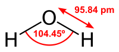
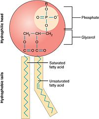

```{title}
Biology
```

```{toc}
```

# Chemistry

`{bm} Chemistry/(Chemistry|Chemical|Chemist)/i` is defined as the study of composition, structure, and properties of matter. `{bm} Matter` is defined as anything that takes up space and has a mass (e.g. hair, water, table, etc..).

```{note}
Primary source for these notes is Khan Academy's Chemistry course, with additional information from Wikipedia and other sources.
```

## Atom

An `{bm} element` is matter that cannot be broken down any further by chemical reaction -- it's a substance made entirely out of one type of `{bm} atom`. Each element/atom has a specific set of properties that defines how it acts/reacts (e.g. weight, colour, how light reflects, etc..).

```{dot}
graph {
  rankdir="LR"
  element -- atom [headlabel="1", taillabel="1..*"];
}
```

Examples of matter made up of a single type of atom:
 * Gold - Yellow coloured, reflective, malleable, and corrosion-resistant.
 * Lead - Blue/white coloured, relatively soft, malleable.
 * Carbon Silver/gray coloured, reflective, easily oxidizes/corrodes.

```{note}
As stated above, matter made up of a single type of atom is called an element.
```

Examples of matter made of multiple types of atoms:
 * Salt water - Mixture of sodium and water.
 * Water - Water can be further broken down to the elements hydrogen and oxygen.
 * Glucose - Glucose can be further broken down to the elements carbon, hydrogen, and oxygen.


The building blocks of atoms are protons, neutrons, and electrons. Protons and neutrons form the nucleus of the atom while electrons jump around in orbit of the nucleus.

For each atom, the number of ...

 * `{bm} proton`s defines the type of atom. For example, hydrogen has 1 proton, helium as 2, lithium has 3, etc..
 * `{bm} neutron`s defines the extra atomic mass of the atom. For example, carbon-12 and carbon-13 have the same number of protons but carbon-13 has 1 more neutron and thus a greater atomic mass.
 * `{bm} electron`s defines the attraction to other atoms. For example, an atom is always looking to have electron count = proton count. It attracts to other atoms in an effort to steal / give away electrons.

Atoms with the same number of protons (same type) but a different number of neutrons (different atomic mass) are called `{bm} isotope`s. For example, carbon-12 and carbon-13 are both isotopes of carbon -- they have the same chemical properties but different mass.

Essentially, the configuration of an atom (number of protons/neutrons/electrons) is what predicts its properties and how it reacts to with other atoms.

The periodic table below orders atoms by the number of protons (also called the `{bm} atomic number`)...


### Atomic Mass

`{bm} Atomic mass` is defined as the mass of the protons and neutrons that make up an atom, but not the electrons . 1 `{bm} atomic mass unit` (`{bm} amu/\b(amu\b)/i`) is `{kt} 1.66054 \cdot 10^{-24}` -- the mass of carbon-12 divided by 12.


```{note}
Why not include electrons into mass calculations? Apparently they contribute little mass so they aren't counted. Also the number of electrons on an atom is transient (it changes easily).
e
Why carbon-12? it's the most abundant form of carbon on earth.
```

TODO: Define atomic weight

TODO: Define atomic weight

TODO: Define atomic weight

TODO: Define atomic weight

TODO: Define atomic weight

TODO: Define atomic weight

TODO: Define atomic weight

TODO: Define atomic weight

TODO: Define atomic weight

TODO: Define atomic weight

TODO: Define atomic weight

## Molecule

When atoms bind together, they form a `{bm} molecule`. Each type of molecule has the same configuration of atoms -- same atoms in the same numbers, structured/shaped similarly. For example, a water molecule is made up of 2 hydrogen atoms and 1 oxygen atom binding together in a house-roof shape...



```{note}
As far as I can tell, the atoms will always bind in the same way. You can't ever have a molecule that has the same types of atoms in the same numbers but with a different structure.
```

A `{bm} monomer` is a special designation for atoms/molecules that are able to join with other monomers to create even larger molecules. The process of joining is called `{bm} polymerization/(polymerization|polymerize)/i` and the resulting molecule is called a `{bm} polymer`.

```{dot}
digraph {
  rankdir=LR;
  "monomer"->"polymer" [taillabel="1..*", headlabel="1", arrowhead=none];
}
```

If the monomers that make up a polymer are all the same, the polymer is called a `{bm} homopolymer`. Otherwise, it's called a `{bm} heteropolymer` / `{bm} copolymer`.

For example, the glucose molecule is a monomer. It can combine with other glucose molecules to create the glycogen molecule, which is a polymer / homopolymer. Other examples of polymers (according to Wikipedia): amino acids and nucleotides (DNA).

```{note}
There are probably special properties to monomers that allow them to chain up. The Wikipedia page talks about a feature of monomers being a "carbon double bond" which is what allows them to form polymers.
```

Polymers are often referred to as `{bm} macromolecule`s -- molecules that have a very large number of atoms.

## Ion

An `{bm} ion/\b(ions|ion)\b/i` is a charged atom or molecule. A charged atom/molecule just means that it has an unequal number of protons and electrons:
* if protons > electrons (more protons), it's called a `{bm} positively charged/(positive charge|positive-charge|positively-charged|positively charged)/i` ion / `{bm} positive ion`.
* if protons < electrons (more electrons), it's called a `{bm} negatively charged/(negative charge|negative-charge|negatively-charged|negatively charged)/i` ion / `{bm} negative ion` / `{bm} ANION`.
* if protons == electrons, it's a neutral (no charge).

Ions are always trying to lose their charge and become neutral, either by giving up an electrons or pulling in an electrons such that the the number of protons and electrons become equal. As such, ions will attract towards oppositely charged ions and repel from similarly charged ions:
* negative ions are attracted to positive ions and repelled from negative ions.
* positive ions are attracted to negative ions and repelled from positive ions.

## pH

`{bm} pH/\b(pH)\b/` stands for *potential of hydrogen* and it's the measure of positively charged hydrogen ions in a solution. The more...
* the more `{bm} acidic/(acidity|acidic|acid)/i` something is, the more positively charged hydrogen ions it has.
* the more `{bm} basic/(basicity|basic)/i` `{bm} /(bases|base)_pH/i` (`{bm} alkaline`) something is, the more reactive it is to positively charged hydrogen ions (it wants to give off electrons to those hydrogen ions).

.png)

pH is scaled logarithmically from 1 to 14. Each notch on the scale moves the acidity/basicity by a factory of 10. Going...
* back a notch (-1) increases acidity / decreases basicity by a factor of 10.
* forward a notch (+1) decreases acidity / increases basicity by a factory of 10.

For example, going from  7 to 4 increases acidity by 1000x times / decreases basicity by 1000x.

The closer to...
* 1 something is, the more acidic it is (more positively charged hydrogen ions) and the more sour/sharp it tastes.
* 14 something is, the more basic it is (more stuff that can react with positively charged hydrogen ions) and the more bitter it tastes.
* 7 something is, the more neutral it is (not reactive).

```{note}
https://www.quora.com/Why-is-pure-water-considered-neutral -- Since pH is defined as the negative log of the hydrogen ion concentration, the pH of pure water is 7 or neutral. Pure water is neutral because the number of positive hydrogen ions produced is equal to the number of negative.
```

# Biology

`{bm} Biology/(Biology|Biological|Biologist)/i` is defined as the study of life / living things. A `{bm} living/\b(living|life)\b/i` thing is defined as anything that converts energy from one form to another, while using that energy to grow, change, and reproduce.

```{note}
Primary source for these notes is Khan Academy's HS Biology course, with additional information from Wikipedia and other sources.
```

## Scientific Method

The `{bm} scientific method` is the standard guideline for discovery and experimentation in the sciences (chemistry, physics, biology, etc..) The `{bm-ri} basic` steps are...

1. Observe.
2. Ask a question about the observation.
3. Make a guess that answers the question (hypothesis).
4. Test the guess to see if it's correct (experiment).
5. Refine and iterate.

The last step (refine and iterate) just means that you do it all over again but make changes based on the things you learned from your experiment. For example, ...

* do additional experiments to dig into some aspect deeper.
* if the hypothesis wasn't supported by the experiment, maybe come up with a new hypothesis.

### Hypothesis

The scientific method revolves around making an observation and coming up with a testable explanation for that observation -- called a `{bm} hypothesis`. If the explanation isn't *testable*, you can't consider it a hypothesis. For example, a good hypothesis may be that increased sun exposure leads to an increased risk of skin cancer because it's something you can test. A bad explanation may be that exposure to centaurs increase the risk of skin cancer because centaurs don't exist (and as such the hypothesis can't be tested).

```{note}
The material mentions that for a hypothesis to be testable, you should be able to come up with an experiment that shows that its false -- it's falsifiable. How you word your hypothesis is typically what determines if it's testable/falsifiable -- when you read the hypothesis, what defines a failure?
```

```{note}
A hypothesis and a theory are different things. Hypothesis is a potential answer for a specific problem. A theory provides a potential framework for a much broader class of problems based on supporting evidence. The example given by the material: "The toaster won't toast because the electrical outlet is broken" is a hypothesis, whereas "Electrical appliances need a source of electricity in order to run" is closer to a theory.
```

### Experiment

Once you have a hypothesis, you design an `{bm} experiment` to test it. In the case of our sun exposure leads to increased risk of skin cancer hypothesis, an experiment may be to expose skin cells to UV rays in amounts equivalent to that given off by the sun and then check to see if those cells have been damaged (compared to a control group of skin cells that you haven't exposed to UV rays).

What makes a good experiment?

* `{bm} Control group` - A control group contains a set of entities that don't get treatment, but those entities are equal to the entities in the `{bm} experimental group` (as much as possible) and exposed to the same conditions as the entities in the experimental group (as much as possible). This helps eliminate outside factors/variables from tainting the results of an experiment -- it's a `{bm} controlled experiment` . For example, in the skin cancer example experiment described above, a control group may be a set of skin cells that sit along side the experimental group skin cells that get treated with UV rays -- the cells in the control group shouldn't show signs of damage while the cells in the experimental group should.
* `{bm} Random selection` - The entities being used for an experiment must be randomly selected (both for the control group and the experimental group). Random selection helps minimize skewed results introduced from bias during the selection process. For example, the individual responsible for selecting candidates for drug trials may choose to disproportionately select people of a certain race (e.g. racism).
* `{bm} Double blind` - The people conducting the experiment may implicitly/explicitly taint the experiment via their own bias. For example, if the experiment involves an interviewer asking a set of questions, the interviewer may subconsciously change the pronunciations of words if he/she knows that the interviewee is in the control group, there by effecting the answer given by the interviewee.
* **Statistical significance** - The results between the control group and the experimental group needs to be large enough to support your hypothesis. A small difference could mean that outcome was due to variance in the selected groups (there's a branch of statistics that deals with this).
* **Replicable** - Others should be able to repeat the same experiment and (hopefully) come to the same result. If they don't, it could be that something was wrong with your experiment or the entities being tested had some underlying difference that changed the result.

```{note}
There's always at least one control group in any experiment to provide a baseline. There's no limit to the number of experimental groups -- each group may have a slightly different type/amount of treatment applied.
```

```{note}
Because things are so wishy-washy/not-exactly in biology, it's typical for an experiments to be repeated multiple times and to have a large sample size -- the larger our sample sizes and the more times we conduct the experiment, the more we can be confident of our result. What do I mean by wishy-washy? Genetic variation between samples may result in different types/levels of responses. For example, people with a certain gene may respond quicker to certain drugs than people who don't produce that gene.
```

Other terminology around the scientific method...

* `{bm} treatment` - The application of the test given to the experimental group(s) but not the control group.
* `{bm} independent variable` - An independent variable is `{bm-ri} basically` the treatment you apply -- you can think of it as the input knob you control for your experiment. For example, in the skin cancer experiment, the independent variable would be the amount of artificial UV rays you apply to the skin cells.
* `{bm} dependent variable` - A dependent variable is a response you measure after applying the treatment -- you can think of it as the output from your experiment. For example, in the skin cancer experiment, the dependent variable might be a measurement of how different the cells are functioning (e.g. a cell with damaged DNA may produce different kinds / amounts of tRNA molecules -- something you can measure).
* **data** - This is exactly what you think it is -- measurements/observations made during the experiment.
* `{bm} placebo effect/(placebo effect|placebo)/i` - When experimenting on people, there's a phenomenon called the placebo effect: if someone takes something that shouldn't help them but are under the impression it will help them, it often times will help them, just from the psychological effect alone.

```{note}
You can have more than one independent variable if you follow specific guidelines and are experienced enough, but the general rule of thumb is to have only 1 independent variable just because it makes things much simpler to analyze/interpret.
```

## Carbohydrate Molecule

`{bm} Carbohydrate/(carbohydrate|sugar)/i`s (also called `{bm} saccharide`s) are molecules that consist of a mix of carbon, hydrogen, and oxygen atoms. In biological systems, carbohydrates are often associated with...
* being a source of energy
* providing a structural role (for plants / certain plants).

```{note}
It was never explained what 'structural role' actually means.
```

The term `{bm} monosaccharide` is just means a carbohydrate that's a monomer (e.g. glucose). Similarly, the term `{bm} polysaccharide` means a carbohydrate built from other monosaccharides (e.g. glycogen is made of chained glucose).

```{dot}
digraph {
  rankdir=LR;
  "monosaccharide"->"polysaccharide" [taillabel="1..*", headlabel="1", arrowhead=none];
}
```

## Protein Molecule

`{bm} Protein`s are molecules that consist of monomers called `{bm} amino acid`s. The amino acids get chained together into a polymer called a `{bm} polypeptide` chain, and one or more polypeptide chains fold to a 3D structure and combine to become a protein. The 3D structure / shape of the protein (how its folded) is what gives it its abilities.

In biological systems, proteins are often associated with that facilitating some biological function. For example, the protein protease is responsible for breaking down food.

```{dot}
digraph {
  rankdir=LR;
  "amino acid"->"polypeptide" [taillabel="1..*", headlabel="1", arrowhead=none];
  "polypeptide"->"protein" [taillabel="1..*", headlabel="1", arrowhead=none];
}
```


```{note}
The ribosome is what's responsible for folding? Not able to get a clear answer on this.
```

The `{bm-ri} basic` structure of an amino acid is as follows. The R is a placeholder that, when set, defines what type of amino acid it is...


## Lipid Molecule

`{bm} Lipid`s are molecules that are somewhat not water soluble -- meaning that they have parts that resist water but maybe also parts that are attracted to water. In biological systems, lipids are often associated with...
* energy storage (fats)
* cellular membranes (phospholipids)


```{note}
Lipids are not always fats. All fats are lipids but not all lipids are fats.
```

## Water Molecule

`{bm} Water` is essential to life -- it has unique properties that almost all biological processes depend on.

Recall that...
1. a water molecule consists of 2 hydrogen atoms connected to an oxygen atom via covalent bonds. A `{bm} covalent bond` is a pair of electrons that both atoms share, thus bonding the atoms together.
1. the position of an electron is based on probability. Electrons aren't fixed in a certain position or neatly orbiting around a nucleus as certain diagrams show. Rather, they're constantly buzzing/hopping around the nucleus. Depending on their environment, they may be more likely to be at certain locations vs other locations.

Oxygen atoms are extremely `{bm} electronegative`, meaning that oxygen has the propensity to pull the buzzing/hopping electrons more around itself than the atoms it's bound to. As such, in a water molecule, the electrons will spend more time solely around the oxygen atom than they do the hydrogen atom or a position that binds the hydrogen and oxygen together. This is what gives the oxygen atom in a water molecule a `{bm} weakly negative` charge (as indicated by δ-) while the hydrogen atoms have a `{bm} weakly positive` charge (as indicated by δ+). These types of charged molecules are called `{bm} polar molecule`s.


```{note}
Notice the shape of the water molecule in the diagram(s) above. Electron pairs are repelled from each other. They're also responsible for binding. That's what gives molecules their shapes/structure.
```

This weakly negative / weakly positive charge is what gives water several of the unique properties that biological properties depend on. Water molecules have a tendency to gravitate towards each other because the weakly negative oxygen atoms and the weakly positive hydrogen atoms of different water molecules attract. This attraction is called a `{bm} hydrogen bond`. Hydrogen bonds are weaker than covalent bonds in that the bonds aren't really solid -- water molecules can easily break off and go past each other.


```{note}
The above paragraph is just giving the mechanics for how/why water is a liquid. Water is the only molecule that's liquid at room temperature? This can't be right -- see https://chemistry.stackexchange.com/q/76346. Why can't biological processes work in one of these other molecules just as they do in water? Maybe because they stay liquid at a shorter temperature range (e.g. 15-25C instead of 1-99C?
```

The weak attraction between water molecules is also what makes water a `{bm} solvent`. So long as they're polar molecules, other molecules can travel inside of water using the same attraction from weakly negative / weakly positive charges -- they gravitate and float around water molecules just as other water molecules do. For example, the cytoplasm of a cell is a solvent (mostly water). It works because other molecules in the cytoplasm (e.g. cellular machinery) can float around / travel around using the weakly negative / weakly positive charges.

Water is called a `{bm} universal solvent` because it can dissolve more molecules than other other liquid. Note that the term universal doesn't mean that it can dissolve everything, just that it can dissolve more things than the others.

The properties that make water conducive for biological processes to operate:

* Fluid under normal conditions - under normal temperatures, pressures, etc.. there's `{bm} cohesion` between other water molecules (fluid) / `{bm} adhesion` between water molecules and other polar molecules / ions (solvent).
* Universal solvent - Water dissolves more things than any other liquid (more things doesn't mean everything).
* High heat capacity - Because it takes a lot of energy to heat up water, its temperature can remain relatively stable as the environment around it changes (temperature regulation).
* High heat of vaporization - As water evaporates, it traps heat from whatever its on (e.g. human body) and releases it into the environment (temperature regulation / cooling).
* Less dense as a solid - As water freezes it forms crystals that space the molecules away from each other. As such, it becomes less dense than liquid water and ends up floats on top. This means bodies of water can freeze over but life can continue operating in the liquid underneath the frozen ice.

Other terminology related to water:
* Molecules that are charged are called polar molecules (e.g. the water molecule is a polar molecule because of its weakly positive / weakly negative charge).
* Molecules / ions that are charged and mixed with a solvent are called `{bm} solute`s.
* Molecules that are attracted to water are called `{bm} hydrophilic`.
* Molecules that are repelled from water are called `{bm} hydrophobic`.
* Molecules that have parts that are hydrophilic as well as parts that are hydrophobic are called `{bm} amphipathic`

## Cell

`{bm} Cell`s are the `{bm-ri} basic` unit of living things / the building blocks of life. They're tiny structures that encapsulate information and machinery that allows them to replicate/reproduce and perform other important functions (e.g. appendages to move around).

```{note}
Viruses are not cells but they may also be considered living because they reproduce in a roundabout way: the require machinery in the host cell to reproduce.
```

There are 2 types of cells: eukaryotic and prokaryotic. There main differences between them are that...

1. the guts of eukaryotes are organized into organelles (membrane-bound compartments) where each one is responsible for some functionality, while prokaryotes have no organelles at all (guts are free floating).
1. the DNA in eukaryotes into multiple independent segments (chromosomes), while prokaryotes have a single circular chain.

Other differences between eukaryotes and prokaryotes ...

```{csv}
!!{ "firstLineHeader": true }
, Eukaryotes, Prokaryotes
Size, 10 to 100 micrometers (μm), 0.1 to 5 micrometers (μm)
Complexity, More complex, More simple
Sub-compartments (organelles), Yes, No
DNA layout, Multiple stands, Single circular strand
Single-cell organisms, Yes (e.g. amoeba), Yes (e.g. bacteria and archaea)
Multi-cell organisms, Yes (e.g. animals and fungus), No
```

```{note}
Archaea is an organism that looks like bacteria but they're totally different.
```

### Features

Different cell species vary in features. The subsections below detail common cell features (not exhaustive).

Some features are only present in certain cell speicies (e.g. only some cells have a flagellum tail) while other features are present in all cells but in different amounts (e.g. every cell has cytosol but larger cells have more cytosol).

#### Cytoplasm

The `{bm} cytoplasm` (both eukaryotic and prokaryotic) is the insides/guts of a cell. `{bm} Cytosol` refers to just the fluid, while cytoplasm refers to fluid as well as everything else inside the cell.

Every cell has cytoplasm.

```{img}
Anima_cell_notext.svg
Eukaryote with cell ribosomes highlighted
By No machine-readable author provided. Chb assumed (based on copyright claims). - No machine-readable source provided. Own work assumed (based on copyright claims)., Public Domain, https://commons.wikimedia.org/w/index.php?curid=688296
scale 0.5 0.5
arrow 1 0.5 0.7 0.5
expand 2 1 0 0
text 0.5 0.5 cytoplasm
text 0.5 0.6 (everything inside)
```

#### Membrane

The `{bm} plasma membrane/(Plasma membrane|Membrane)/i` (present in both eukaryotic and prokaryotic cells) is the thing encapsulating the cytoplasm. It's what keeps the guys of the cell inside and controls the movement of substances coming into / going out of the cytoplasm.

Every cell has a membrane encapsulating its cytoplasm. Membranes in general follow the fluid mosaic model.

The term membrane can refer to either the plasma membrane or the membrane of a eukaryotic cell's organelle. How you should interpret it depends on the context in which its used.

```{img}
Anima_cell_notext.svg
Eukaryote with cell ribosomes highlighted
By No machine-readable author provided. Chb assumed (based on copyright claims). - No machine-readable source provided. Own work assumed (based on copyright claims)., Public Domain, https://commons.wikimedia.org/w/index.php?curid=688296
scale 0.5 0.5
arrow 1 0.5 0.81 0.6
expand 2 1 0 0
text 0.5 0.5 cell membrane
text 0.5 0.6 (holds everything in)
```

```{img}
Average_prokaryote_cell-_unlabled.svg
Prokaryotic with capsule highlighted
By Mariana Ruiz Villarreal LadyofHats - Own work, Public Domain, https://commons.wikimedia.org/w/index.php?curid=7356226
scale 0.5 0.5
arrow 1 0.5 0.8 0.5
expand 2 1 0 0
text 0.5 0.5 cell membrane
text 0.5 0.6 (inner layer)
```

Facts about cell membranes:

 * Membranes have other molecules embedded in them for identification, moving stuff in/out, etc.. (see fluid mosaic model).
 * Membranes are semipermeable. Uncharged substances such as carbon dioxide and oxygen move across fine, while charged ions or large molecules require either
   * membrane proteins such as a carrier protein or a channel protein (see fluid mosaic model).
   * membrane wrapper (see golgi).

#### Cell Wall

The `{bm} cell wall` (present in both eukaryotic and prokaryotic cells) is a stiff layer around the membrane meant for protection. *Not all cells have a cell wall* -- for example, animal cells don't but plant cells do. Technically, the cell wall (if it exists) isn't considered to be part of the cell. The membrane and everything in it is.

The material states that cell walls...
1. provide an extra layer of protection.
1. help maintain shape.
1. help prevent dehydration.

Almost all prokaryotes have cell walls. Only some eukaryotes have cell walls (e.g. fungi and plants). The material says that cell walls for most bacteria are made up of a molecule called `{bm} peptidoglycan`, but it can be different for other cells. For example, [this link](https://www.quora.com/Do-Eukaryotes-have-cell-walls) says that plant cells have cell walls made up of cellulose.

```{img}
Average_prokaryote_cell-_unlabled.svg
Prokaryotic with capsule highlighted
By Mariana Ruiz Villarreal LadyofHats - Own work, Public Domain, https://commons.wikimedia.org/w/index.php?curid=7356226
scale 0.5 0.5
arrow 1 0.5 0.85 0.5
expand 2 1 0 0
text 0.5 0.5 cell wall
text 0.5 0.6 (middle layer)
```

#### Capsule

The `{bm} Capsule` (present in prokaryotic cell only) is the outermost layer of some types of cells (typically bacteria cells). Capsules are made up of carbohydrates and there mainly to help the cell stick itself to the environment.

```{img}
Average_prokaryote_cell-_unlabled.svg
Prokaryotic with capsule highlighted
By Mariana Ruiz Villarreal LadyofHats - Own work, Public Domain, https://commons.wikimedia.org/w/index.php?curid=7356226
scale 0.5 0.5
arrow 1 0.5 0.9 0.5
expand 2 1 0 0
text 0.5 0.5 capsule
text 0.5 0.6 (outter-most layer)
```

```{note}
Although eukaryotic cells don't have capsules, they do have carbohydrates on their outside. Those carbohydrates aren't organized as a capsule though: https://www.quora.com/Do-some-eukaryotic-cells-have-capsules-or-is-it-just-prokaryotes-Are-there-exceptions-of-eukaryotes-having-capsules. Is this talking about the same carbohydrates that are embedded in the membrane (glycolipids / glycoproteins).
```

#### Ribosome

`{bm} Ribosome` (present in both eukaryotic and prokaryotic cells) are tiny molecular machines inside the cytoplasm that take in mRNA molecules (portions of DNA that have been written out) and produce proteins. Ribosomes themselves are structures made of proteins and RNA.

Ribosomes can either be floating around in the cytoplasm (called `{bm} free ribosome`) or be embedded in the membrane of endoplasmic reticulum.

```{img}
Anima_cell_notext.svg
Eukaryote with cell ribosomes highlighted
By No machine-readable author provided. Chb assumed (based on copyright claims). - No machine-readable source provided. Own work assumed (based on copyright claims)., Public Domain, https://commons.wikimedia.org/w/index.php?curid=688296
crop 0.32 0.16 0.6 0.34
arrow 0.9 0.5 0.5 0.6
arrow 0.9 0.5 0.65 0.35
expand 1.3 1 0 0
text 0.7 0.5 ribosomes
text 0.7 0.65 (little blue dots)
```

#### Appendage

Some cells have appendages that help them move (or stay put). There are different types of appendages...
  * `{bm} Flagellum` are tails that extend from the cell (e.g. tail on a sperm cell). There can be more than 1 flagellum.
  * `{bm} Cilia/\b(Cil|Cils|Cilia)\b/i` are much smaller hair-like appendages used to help move the cell itself or things in the vicinity of the cell.
  * `{bm} Fimbriae` are much smaller hair-like appendages used to help attach to host cells and surfaces (e.g. bacteria cells).
  * `{bm} Pili` are much smaller hair-like appendages used to help transfer DNA between cells and/or to help move (e.g. bacteria cells).
  * `{bm} Pseudopodia/\b(Pseudopod|Pseudopodia)\b/i` are much larger leg-like appendages used to crawl (e.g. amoeba cells).

  ```{img}
  Anima_cell_notext.svg
  Eukaryote with cell flagellum highlighted
  By No machine-readable author provided. Chb assumed (based on copyright claims). - No machine-readable source provided. Own work assumed (based on copyright claims)., Public Domain, https://commons.wikimedia.org/w/index.php?curid=688296
  scale 0.5 0.5
  arrow 1 0.5 0.3 0.84
  expand 2 1 0 0
  text 0.5 0.5 flagellum
  ```

### Fluid Mosaic Model

The `{bm} fluid mosaic model` is the accepted model for how cell membranes work. The model says that a cell membrane is composed of a phospholipid bilayer with proteins, lipids, and carbohydrates floating around on either side or embedded in between.

```{note}
The description above is the rational for the name 'fluid mosaic model'. It's fluid and there's a mosaic of different things embedded or attached to it.
```


A `{bm} phospholipid` is a amphipathic lipid molecule that involves a phosphate group. The...
* bulbus phosphate group at the top is hydrophilic -- it has a charge and as such is attracted to water (either the cytoplasm or the fluid outside the cell).
* long fatty acid tails are hydrophobic -- they have no obvious charge and as such aren't attracted to water.

```{note}
For a refresher on how hydrophobic / hydrophilic molecules work, see the section on Water. Specifically: adhesion / weakly negative / weakly positive.
```



As such, phospholipids have a natural tendency to form as a `{bm} phospholipid bilayer` (2 layers attached together, called a `{bm} liposome`) or a ball (called a `{bm} micelle`). The hydrophilic heads are going to point towards the water causing the hydrophobic tails to point at each other.


```{note}
If the phospholipids have small tails, they may form a micelle (a small, single-layered sphere), while if they have bulkier tails, they may form a liposome.
```

How fluid a phospholipid bilayer is depends on the types of phospholipid molecules that make it up and the temperature. Phospholipid molecules have 2 fatty acid tails. The fatty acid tails can be either...

* both saturated (straight tails)
* one saturated (straight tail) and one unsaturated (bent tail).

At cooler temperatures, phospholipids that have 2 saturated fatty acid tails (straight tails) tend to get more rigid / dense because they can more easily pack together. Phospholipids with unsaturated fatty acid tails (bent tails) don't end up getting as rigid / dense, allowing the membrane to stay fluid at lower temperatures. Cholesterol embedded in the phospholipid bilayer also helps it stay more fluid at lower temperatures.

```{note}
Phospholipid bilayers have the consistency of oil-based salad dressing. It may seem weak but it's strong enough to act as a separator between the environment inside and the environment outside. Water from one-side can move to the other but does so very rarely -- a single molecule may sneak through the layer every now and then. Aquaporins are proteins embedded in the phospholipid bilayer that allow water to rapidly pass (when needed).
```

Examples of molecules that can be embedded in or attached to the phospholipid bilayer include...

* `{bm} Glycolipid`s / `{bm} Glycoprotein`s - These are lipids and proteins with carbohydrates attached to them and are typically found pointing outside of the cell. These carbohydrates are how a cell identifies if a neighbouring cell is foreign or not.
* `{bm} Integral protein/(integral protein|integral enzyme)/i`s - Proteins that are partially hydrophobic. Either one end of the protein is anchored inside the membrane or the protein is fully going through the membrane.
  * `{bm} Transmembrane protein/(transmembrane protein|transmembrane enzyme)/i`s - Proteins that have one end inside the cytoplasm and the other outside of the cell. Typical use case for these types of proteins is moving substances from inside the cell (cytoplasm) to outside the cell and vice-versa: `{bm} channel protein`s and `{bm} carrier protein`s.
* `{bm} Peripheral protein/(peripheral protein|peripheral enzyme)/i`s - Proteins that are found on the surface of the protein (either on the cytoplasm side or the outside side). Unlike integral proteins, they don't have any portion going inside the membrane. As such, they more freely move around compared to integral proteins.
* `{bm} Cholesterol` - Sits inside of the membrane to help ensure that the membrane doesn't become too stiff.

```{note}
See first diagram in this section for an example of each of the molecules listed above.
```

The term `{bm} facilitated diffusion` refers to the movement of molecules across the membrane via proteins embedded in the membrane (e.g. channel proteins and/or carrier proteins). These molecules wouldn't be able to cross the membrane by themselves. For example, the sodium potassium pump (carrier protein) helps sodium and potassium ions move across the cell membrane by opening/closing its gates.

### History of Modern Cell Theory

The first record of a cell was in 1665 when `{bm} Robert Hooke` published a book called The Micrographia. The book contains drawings of observations he made while looking at various dead organisms through a rudimentary microscope.

A few years later, a Dutch lenscrafter by the name of `{bm} Antonie Van Leeuwenhoek/\b(Antonie Van Leeuwenhoek|Anthony Van Leeuwenhoek)\b/i` decided to use his expertise to craft a better microscope to better observe living cells / organisms. For example, he was able to observe sperm and Protists (unicellular organisms while he dubbed `{bm} animalcule`s).

In the 1830s, `{bm} Matthias Schleiden` and `{bm} Theodore Schwann` began laying the groundwork for modern cell theory. They came up with the idea that...
1. all life is composed of one or more cells.
2. a cell is the `{bm-ri} basic` unit of life.

They also suspected that cells come from other cells, but didn't know for sure if that was the only way they were produced. It was `{bm} Robert Remak` that in the mid-1800s established that...

3. all cells come from other cells.

`{bm} /\b(Rudolph Virchoi|Rudolph Virchow)\b/i`

```{note}
The credit for this sometimes goes to Rudolph Virchoi but it's been established that he was a plagiarist.
```

It's still an open question as to how the first / initial cell came to be. The current working theory is that, 3.5 billion years ago, phospholipids (the molecules that form the membrane of a cell) naturally form bilayers and connect in a circle. A membrane may have naturally encapsulated a set of arbitrary self-replicating molecules (e.g. protein or RNA) and that's how the first cell began growing and splitting off.

```{note}
There are an estimated 37 trillion cells in the human body.
```

## Eukaryotic Cell

```{img}
Animal_cell_structure_en.svg
ANIMAL CELL
By Mariana Ruiz Villarreal, LadyofHats - Own work (Source: Typical prokaryotic cell, Chapter 4: Mutagenicity of alkyl N-acetoxybenzohydroxamates, Concept 1: Common Features of All Cells, Cells - Structure and Function), Public Domain, https://commons.wikimedia.org/w/index.php?curid=3648821
text 0.45 0.05 ANIMAL CELL

bg_color #00000000

fg_color #ff00ffff
rect 0.25 0.012 0.17 0.23
fg_color #0000ffff
rect 0.01 0.55 0.24 0.08
fg_color #007f7fff
rect 0.01 0.44 0.24 0.075
fg_color #00ff00ff
rect 0.81 0.355 0.18 0.04
fg_color #7f7f00ff
rect 0.81 0.285 0.18 0.04
fg_color #000080ff
rect 0.81 0.205 0.18 0.04
```

```{img}
Plant_cell_structure-en.svg
Eukaryotic plant cell
By LadyofHats - Self-made using Adobe Illustrator. (The original edited was also made by me, LadyofHats), Public Domain, https://commons.wikimedia.org/w/index.php?curid=844682
text 0.45 0.1 PLANT CELL

bg_color #00000000

fg_color #ff0000ff
rect 0.01 0.25 0.2 0.135
fg_color #800080ff
rect 0.01 0.395 0.2 0.11
fg_color #ff00ffff
rect 0.79 0.75 0.17 0.16
fg_color #0000ffff
rect 0.46 0.87 0.13 0.11
fg_color #0000ffff
rect 0.86 0.34 0.135 0.11
fg_color #00ff00ff
rect 0.01 0.51 0.2 0.08
fg_color #0000ffff
rect 0.01 0.6 0.2 0.06
fg_color #007f7fff
rect 0.18 0.8 0.27 0.15
```

`{bm} Eukaryotic/(Eukaryote|Eukaryotic)/i` cells are typically larger and have membrane-bound sub-compartments, called organelle, that hold in the guts of different regions of the cell. For example, their DNA is encapsulated in a organelle called the nucleus.

Eukaryotes have their DNA broken up into multiple strands called chromosomes. They can either be single-cellular organisms (e.g. amoeba) or multi-cellular organisms (e.g. human). Single-cellular organism that are eukaryotic are called `{bm} protist`s.

The following are descriptions for some of the organelles shown in the diagram above.

* <span style="color:#ff00ffff">**`{bm-ri} Nucleus`**</span> - See nucleus section.
* <span style="color:#0000ffff">**`{bm-ri} Endoplasmic Reticulum`**</span> - See endoplasmic reticulum section.
* <span style="color:#007f7fff">**`{bm-ri} Golgi`**</span> - See golgi section.
* <span style="color:#00ff00ff">**`{bm-ri} Mitochondria`**</span> - See mitochondria section.
* <span style="color:#7f7f00ff">**`{bm-ri} Lysosome`**</span> (mostly animal) - See lysosome section.
* <span style="color:#0000ffff">**`{bm-ri} Peroxisome`**</span> - See peroxisome section. 
* <span style="color:#ff0000ff">**`{bm-ri} Chloroplast`**</span> (plant / algae) - See chloroplast section.
* <span style="color:#800080ff">**`{bm-ri} Vacuole`**</span> (mostly plant / algae) - See vacuole section. 

### Organelle

Eukaryotic cells have membrane-bound sub-compartments, called `{bm} organelle`s, that house different functional regions of the cell. The following subsections detail common organelles.

#### Nucleus

`{bm} Nucleus/\b(Nucleus|Nuclei)\b/i` is an organelle that contains DNA (genetic information required for the functioning and replication). Both prokaryotic and eukaryotic cells have DNA, but only eukaryotic cells have a nucleus. In prokaryotic cells, the DNA flows around freely instead of being encapsulated in a nucleus.

```{img}
Diagram_human_cell_nucleus.svg
 comprehensive diagram of a human cell nucleus.
By Mariana Ruiz LadyofHats - I did it myself with adobe ilustrator using the information found here [1], [2] ,[3], [4] and [5], Public Domain, https://commons.wikimedia.org/w/index.php?curid=736389
scale 0.75 0.75
```

Most eukaryotic cells contain a single nucleus, but some contain can have 0 and others can have more than one. An example of 0 is blood cells -- mature blood cells don't have any DNA, therefore no nucleus. An example of more than 1 is the organism Oxytricha trifillax -- it contains 2 nuclei, each containing different DNA (its DNA is fragmented across 2 nuclei).

#### Endoplasmic Reticulum

`{bm} Endoplasmic Reticulum` is layered membrane (organelle?) that surrounds the nucleus and is directly connected to pores on the nucleus. Large portions of the endoplasmic reticulum's membrane have ribosomes attached. The parts that have ribosomes attached are called `{bm} rough endoplasmic reticulum` while the parts that don't are called `{bm} smooth endoplasmic reticulum`.

```{note}
It's called rough endoplasmic reticulum because the ribosomes make the surface look rough.
```

```{img}
0313_Endoplasmic_Reticulum.jpg
a) The ER is a winding network of thin membranous sacs found in close association with the cell nucleus. The smooth and rough endoplasmic reticula are very different in appearance and function (source: mouse tissue). (b) Rough ER is studded with numerous ribosomes, which are sites of protein synthesis (source: mouse tissue). EM × 110,000. (c) Smooth ER synthesizes phospholipids, steroid hormones, regulates the concentration of cellular Ca++, metabolizes some carbohydrates, and breaks down certain toxins (source: mouse tissue). EM × 110,510. (Micrographs provided by the Regents of University of Michigan Medical School © 2012)
By OpenStax - https://cnx.org/contents/FPtK1zmh@8.25:fEI3C8Ot@10/Preface, CC BY 4.0, https://commons.wikimedia.org/w/index.php?curid=30131197
scale 0.5 0.5
```

Recall that ribosomes are what translate mRNA to proteins. Since the endoplasmic reticulum is directly connected to the nucleus (via pores on the nucleus), it provides a fairly straight-forward path for protein generation: mRNA produced in the nucleus...
1. travels to the endoplasmic reticulum via the connected pores,
2. then travels to the membrane of the endoplasmic reticulum where it ends up hitting ribosomes embedded in the (thereby producing proteins).

#### Golgi

`{bm} Golgi/(Golgi Apparatus|Golgi Complex|Golgi Body|Golgi)/i`</span> are layered membrane (organelle?) that look similar to rough endoplasmic reticulum but aren't attached to the nucleus. Golgi package molecules (e.g. proteins) for travel to either another part of the cell or outside of the cell. They do this by pinching off parts of their membrane to wrap around the molecule.

They're also responsible for building lysosomes (cell digestion machines).

```{note}
The terms golgi, golgi apparatus, golgi complex, and golgi body all refer to the same thing.
```

```{img}
Golgi_apparatus_(borderless_version)-en.svg
Golgi apparatus
By Kelvinsong - Own work, CC BY 3.0, https://commons.wikimedia.org/w/index.php?curid=23090802
scale 0.15 0.15
```

#### Mitochondria
`{bm} Mitochondria/(Mitochondria|Mitochondrion)/i`</span> are organelles responsible for cellular respiration: the process of producing Adenosine Triphosphate (ATP) from molecules such as sugars. ATP is a chemical that provides energy to drive various biological processes (e.g. muscle contractions). As such, mitochondria are often referred to as "the power house of the cell."

```{img}
Animal_mitochondrion_diagram_en.svg
Mitochondria
By Mariana Ruiz Villarreal LadyofHats - the diagram i made myself using adobe illustrator. as a source for the information i used the diagrams found here:[1], [2], [3], [4], [5], [6] and [7]., Public Domain, https://commons.wikimedia.org/w/index.php?curid=8152599
scale 0.75 0.75

bg_color #00000000

fg_color #ff00ffff
rect 0.13 0.12 0.3 0.07
fg_color #ff00ffff
rect 0.7 0.75 0.3 0.12

fg_color #008080ff
rect 0.3 0.18 0.15 0.07

fg_color #808000ff
rect 0.13 0.35 0.13 0.07
```

```{note}
Mitochondria exist in both animal and plant cells. 
```

The major parts of chloroplast are...

 * <span style="color:#ff00ffff">`{bm} mitochondrial envelope`</span> - 2 membrane layers that have a gap between them. Holds the guts in.
 * <span style="color:#008080ff">`{bm} matrix`</span> - Internal fluid of mitochondria. Contains the guts (ribosomes, mitochondrial DNA, and more).
 * <span style="color:#808000ff">`{bm} cristae`</span> - Long caverns that encapsulate and connect different parts of the matrix.

Mitochondria have their own independent DNA (different from the DNA in the nucleus). It's speculated that at some point in the past they may have been independent single-cell organisms that formed a symbiotic relationship with a larger cell by `{bm-ri} living` in it, eventually becoming part of the cell (endosymbiosis).

Unlike how normal offspring DNA gets produced by mixing DNA from both parents, mitochondrial DNA comes entirely from the mother's side.


#### Lysosome

`{bm} Lysosome`s are organelles (animal cells only) that help break down waste `{bm-ri} products` / foreign substances by containing various enzymes and maintaining an acidic pH. Lysosomes are more often found in animals cells than plant and algae cells.

```{note}
According to the material, the evidence that they've been found in plant cells is recent.
```

```{img}
Lysosome.jpg
Structure of Lysosome
By lumoreno - Own work, CC BY-SA 3.0, https://commons.wikimedia.org/w/index.php?curid=17380475
crop 0.05 0.05 0.9 0.9
scale 0.5 0.5
```

#### Peroxisome

`{bm} Peroxisome`s are organelles that are similar to Lysosomes -- both are small organelles that break down unwanted substances. The difference is that peroxisomes have different types of enzymes that require oxygen (oxidative enzymes).

```{note}
The material says that peroxisomes make hydrogen peroxide: Similarly, structures called peroxisomes carry out chemical reactions called oxidation reactions and produce hydrogen peroxide, both of which would damage the cell if they weren’t safely stored away in their own “room.”
```

```{img}
Peroxisome.svg
Basic structure of a peroxisome, showing the crystallized enzyme core as found in rat liver cells.
By Qef - Own work by uploader, based on the arrangement of a bitmap equivalent by Anthony Atkielski (Agateller), Public Domain, https://commons.wikimedia.org/w/index.php?curid=7072127
scale 0.5 0.5
```

#### Chloroplast

`{bm} Chloroplast`s are organelle (only plant and algae cells) responsible for photosynthesis. Photosynthesis is the process of taking in light and using it to build sugars from water and carbon dioxide. Those sugars are then used by the mitochondria to produce energy in a process called cellular respiration.

```{img}
Chloroplast_structure.svg
Ultrastructure of a chloroplast.
By Kelvinsong - Own work, CC BY-SA 3.0, https://commons.wikimedia.org/w/index.php?curid=26147364
scale 0.5 0.5

bg_color #00000000

fg_color #ff00ffff
rect 0.025 0.13 0.3 0.15
fg_color #808000ff
rect 0.24 0.015 0.3 0.15
fg_color #008080ff
rect 0.85 0.2 0.15 0.07
fg_color #ff0000ff
rect 0.035 0.35 0.15 0.07
```

The major parts of chloroplast are...

 * <span style="color:#ff00ffff">`{bm} chloroplast envelope`</span> - 2 membrane layers that have a gap between them. Holds the guts in.
 * <span style="color:#008080ff">`{bm} stroma`</span> - Internal fluid of chloroplast (chloroplast's version of cytosol).
 * <span style="color:#808000ff">`{bm} thylakoid`</span> - Membrane-bound discs. The membrane contains light-harvesting substances while the space inside (also called `{bm} lumen`) is hollow.
 * <span style="color:#ff0000ff">`{bm} grana/(grana|granum)/i`</span> - Stack of thylakoids. These stacks are interconnected. The singular of grana is granum.

 `{bm} Chlorophyll` is a pigment / compound found in chloroplast that absorbs light and uses it to produce carbohydrates. It's found in the thylakoid membrane as well as the stroma, and it only absorbs red and blue light (while reflecting green).

 Like mitochondria, chloroplast have their own independent DNA (different from the DNA in the nucleus). It's speculated that at some point in the past they may have been independent single-cell organisms that formed a symbiotic relationship with a larger cell by `{bm-ri} living` in it, eventually becoming part of the cell (endosymbiosis). A descendant of that organism may be `{bm} cyanobacterium/(cyanobacterium|cyanobacteria)/i`, which has a similar ability to generate sugars from light (see [Wikipedia](https://en.wikipedia.org/w/index.php?title=Chloroplast&oldid=918130624#Parent_group:_Cyanobacteria)).

#### Vacuole

`{bm} Vacuole`s are organelle (mostly plant and algae cells) responsible for storage (water, food, waste?) and enzymes that help break things down. Vacuoles are typically found in plant and algae cells, but may also exist in animal cells. The ones in plants / algae tend to be much larger.

Vacuoles are often responsible for a plant's shape. For example, a well watered plant will be upright and spry because its vacuoles are full. A plant that isn't as well watered may be sagging down or wilting because the vacuoles are less full

```{img}
Turgor_pressure_on_plant_cells_diagram.svg
By LadyofHats - did it myself based on [1], [2] ,[3] and [4]., Public Domain, https://commons.wikimedia.org/w/index.php?curid=1685428
In biology, turgor pressure or turgidity is the pressure of the cell contents against the cell wall, in plant cells, determined by the water content of the vacuole, resulting from osmotic pressure. 
scale 0.7 0.7
```

### Chromosome

The genome of eukaryotes are split into linear strands of DNA. These linear DNA strands come in 2 forms...

1. `{bm} Chromatin` is the normal state, where the DNA is loosely floating around with structural proteins called `{bm} histone`s.
1. `{bm} Chromatid` is the state where it's going through replication. The DNA is packed using even more structural proteins called  `{bm} scaffold protein`s and the entire thing has a copy of itself attached. The original and the copy are individually referred to as `{bm} sister chromatid`s. Together they're referred to as a `{bm} sister chromatid pair`.

Chromatin and chromatid are mutually exclusive. As long as it has a copy attached to it, it's referred to as chromatid. Otherwise, it's referred to as chromatin.

The term `{bm} chromosome` can refer either to a chromatin or a sister chromatid pair, but never a single sister chromatid.

```{img}
Chromatin_Structures.png
By Original uploader was Richard Wheeler at en.wikipedia - Transferred from en.wikipedia to Commons by sevela.p., CC BY-SA 3.0, https://commons.wikimedia.org/w/index.php?curid=4017531
The major chromatin structures.
scale 0.5 0.5
```

Each chromosome codes for the same set of genes. Since eukaryotes reproduce sexually (mother and father required), they contain genetic information from both the mother and father. The way this manifests itself is that most eukaryotes will come with multiple versions of the same chromosome. In...

 * humans, that's 2n chromosomes (2 chromosomes that are alternate versions of each other, called diploid).
 * louts plants, that's >2n chromosomes (2 or more chromosomes that are alternate versions of each other, called polyploid).

These chromosomes are referred to as `{bm} homologous chromosomes/(homologous chromosome|homologous chromosome pair|homologous pair of chromosomes|chromosomes of a homologous pair)/i`: 2 or more chromosomes that code for the same set of genes but aren't exactly the same (different versions of the same genes). In other words, the chromosomes are homologous.

```{note}
An example straight from the material of homologous pair of chromosomes working: As a real example, let's consider a gene on chromosome 9 that determines blood type (A, B, AB, or O). It's possible for a person to have two identical copies of this gene, one on each homologous chromosome—for example, you may have a double dose of the gene version for type A. On the other hand, you may have two different gene versions on your two homologous chromosomes, such as one for type A and one for type B (giving AB blood).

A different version of the same gene is called an allele.
```

When creating cells for reproduction (gamete cells), the cells only keep 1 copy from each each homologous chromosome pair. These cells are referred to as haploid cells because they only carrying n chromosomes.

```{note}
To see how gametes are formed, see the meiosis section.
```

To recap, a cell can have a number of chromosome copies:

 * `{bm} diploid` cells carry 2n chromosomes (2 copies of each chromosome). 1 copy comes from the mother and the other comes from the father, and the copies aren't identical -- they code for different versions of the same genes. Each of the 2 copies are said to be a homologous chromosome pair. Examples include animal somatic cells and animal germ cells.
 * `{bm} haploid` cells carry n chromosomes (1 copy of each chromosome). Examples include animal gamete cells and most unicellular eukaryotes.
 * `{bm} polyploid` cells carry An chromosomes, where A > 2 (more than 2 copies of each chromosome). Examples include certain plant species (e.g. lotus plants).

```{note}
An organism has an extra / missing copy of a chromosome (e.g. 2 expected but 3 present) is called aneuploid.
```

The following diagram shows a karyotype of a human's diploid homologous chromosome pairs 1 2 and 3:

```{img}
DNA_human_male_chromosomes.gif
By National Human Genome Research Institute, http://www.genome.gov/Images/EdKit/bio1c_large.gif, Public Domain, https://commons.wikimedia.org/w/index.php?curid=2132905
DNA, human male chromosomes
scale 0.5 0.5
crop 0 0 0.5 0.25
```

Certain eukaryotic species (some mammals/snakes/insects/etc..) have an extra pair of chromosomes that aren't alternate versions of each other but instead are totally different and used to determine the sex of the offspring. This extra pair is called `{bm} sex chromosome/(sex chromosome|sex determining chromosome|sex-determining chromosome)/i`s / `{bm} XY chromosome/(XY chromosome|X\/Y chromosome|X-Y chromosome)/i`s, and it determines the sex of the organism. The X and the Y refer to the chromosome types that can appear in the pair -- XX results in a female, while XY results in a male.

The chromosomes that make up the homologous chromosomes are sometimes referred to as `{bm} autosome/(autosome|autosomal chromosome)/i`s while the ones that make up sex-determining chromosomes (non-homologous chromosomes) are called `{bm} allosome/(allosome|allosomal chromosome)/i`s. For example, in humans there are 44 autosomes (22 homologous chromosome pairs) and 2 allosomes (1 sex-determining chromosome pair).

```{img}
DNA_human_male_chromosomes.gif
By National Human Genome Research Institute, http://www.genome.gov/Images/EdKit/bio1c_large.gif, Public Domain, https://commons.wikimedia.org/w/index.php?curid=2132905
DNA, human male chromosomes
scale 0.3 0.3

fg_color #ff0000ff
bg_color #00000000
rect 0.85 0.78 0.14 0.215
```

An organism has an extra / missing copy of a chromosome (e.g. 2 expected but 3 present) is called `{bm} aneuploid`. Depending on the species and circumstances, aneuploidy may lead to death, disease, or possibly no adverse effects at all. For example, allosomal aneuploidy in certain female mammals rarely leads to adverse effects because of X-linked inactivation.


### Mitosis (Cell Cycle)

The `{bm} cell cycle` is the sequence of events a cell goes through from when it's created (divides off) up to when it divides itself. In eukaryotic cells, the cell cycle has 2 major phases:

 1. Interphase: The majority of a cell's life is spent in interphase, where it's growing and going about its business.
 1. Mitotic phase: The portion of a cell's life where it divides into 2 new cells. 

Each phase has a set of inner phases it goes through.

```{img}
Animal_cell_cycle-en_UNCLUTTERED.svg
By Kelvinsong - Own work, CC0, https://commons.wikimedia.org/w/index.php?curid=22965076
Animal cell cycle
scale 0.35 0.35
```

#### Interphase

The majority of a cell's life is spent in `{bm} interphase`, where it's growing and going about its business.

```{img}
Animal_cell_cycle-en_UNCLUTTERED.svg
By Kelvinsong - Own work, CC0, https://commons.wikimedia.org/w/index.php?curid=22965076
Animal cell cycle
scale 0.35 0.35
crop 0 0 0.446 1
```

1. `{bm} G1 phase` / `{bm} Gap 1 phase` /  `{bm} Gap I phase`
  
   ```{img}
   G1 Phase.svg
   By Kelvinsong - Own work, CC0, https://commons.wikimedia.org/w/index.php?curid=22965076
   G1 phase showing the cell growing
   scale 0.1 0.1
   ```

   The cell grows.
   
   Prior to entering the next phase, the cell can go into the `{bm} G0 phase` / `{bm} resting phase`,  where it's essentially pausing division. One reason for this may be `{bm} contact inhibition`: when cells start touching up on other cells, it's a signal that it's becoming too crowded and that they should stop dividing. 

1. `{bm} S phase` / `{bm} Synthesis phase`
  
   ```{img}
   S Phase.svg
   By Kelvinsong - Own work, CC0, https://commons.wikimedia.org/w/index.php?curid=22965076
   S Phase showing chromatin and centrosome replication
   scale 0.1 0.1
   ```

   The chromatin in the nucleus gets replicated to become a sister chromatid pair (2 copies that are attached). The centrosome also gets duplicated.

1. `{bm} G2 phase` / `{bm} Gap 2 phase` /  `{bm} Gap II phase`

   ```{img}
   G2 Phase.svg
   By Kelvinsong - Own work, CC0, https://commons.wikimedia.org/w/index.php?curid=22965076
   G2 phase showing the cell growing even more
   scale 0.1 0.1
   ```

   The cell grows more.

#### Mitotic Phase

The `{bm} mitotic phase/(Mitotic phase|Mitotic|Mitosis)/i` is portion of a cell's life where it divides into 2 new daughter cells.

```{img}
Animal_cell_cycle-en_UNCLUTTERED.svg
By Kelvinsong - Own work, CC0, https://commons.wikimedia.org/w/index.php?curid=22965076
Animal cell cycle
scale 0.35 0.35
crop 0.446 0 0.554 1
```

1. `{bm} Prophase` / `{bm} Prometaphase`

   ```{img}
   Prophase.svg
   By Kelvinsong - Own work, CC0, https://commons.wikimedia.org/w/index.php?curid=22965076
   Prophase showing the sister chromatid condensing and nucleus membrane breaking down
   scale 0.1 0.1
   ```

   The sister chromatid pairs start to condense into an X shape, where the only part they remain attached at is their centromeres. The membrane of the nucleus goes away and the 2 centrosomes that were originally attached to that membrane get moved to opposite ends of the cell.

   Microtubules are attached from the centrosomes to the kinetochore of the sister chromatid pairs. `{bm} Kinetochore`s are proteins located at the centromere of the sister chromatids.

1. `{bm} Metaphase`

   ```{img}
   Metaphase.svg
   By Kelvinsong - Own work, CC0, https://commons.wikimedia.org/w/index.php?curid=22965076
   Metaphase showing the sister chromatid lining up
   scale 0.1 0.1
   ```

   The sister chromatid pairs line up in the middle of the cell.

1. `{bm} Anaphase`

   ```{img}
   Anaphase.svg
   By Kelvinsong - Own work, CC0, https://commons.wikimedia.org/w/index.php?curid=22965076
   Anaphase showing the sister chromatid breaking apart
   scale 0.1 0.1
   ```

   As the cell splits apart, the microtubules also split apart the sister chromatid pairs. Once split, they're individually referred to as chromatin again.

   ```{note}
   I believe the labeling on the above diagram to be incorrect. Once split, they're no longer referred to as sister chromatids / chromatids. They're referred to as chromatin.
   ```

1. `{bm} Telophase` and `{bm} Cytokinesis`

   ```{img}
   Telophase and Cytokinesis.svg
   By Kelvinsong - Own work, CC0, https://commons.wikimedia.org/w/index.php?curid=22965076
   Telophase / cytokinesis showing nucleus membranes re-forming and cell finally splitting into 2
   scale 0.1 0.1
   ```

   During telophase, nucleus membranes re-form around the newly split chromatin. The chromatin also start to un-condense.

   During cytokinesis, the middle of the cell starts to push together and pinch off, forming 2 separate cells. Cytokinesis technically happens in parallel with mitosis (it isn't a part of mitosis), but it starts near the end of mitosis (around telophase).

### Meiosis

`{bm-ambiguous} Add the suffix _GAMETE if referring to egg or ova cells, or _NORM/\b(egg)/i`
`{bm-ambiguous} Add the suffix _GAMETE if referring to egg or ova cells, or _NORM/\b(ova)/i` 
`{bm-ignore} (egg)_NORM/i`
`{bm-ignore} (ova)_NORM/i`

`{bm} Meiosis` is a type of eukaryotic cell division that results in 4 daughter cells, where each daughter cell has half the number of chromosomes as the parent cell.

The source cell is known as a `{bm} germ` cell -- a cell that can either go through mitosis or meiosis. `{bm} Somatic` cells, on the other hand, are general body cells and can only go through mitosis.

The resulting daughter cells are known as `{bm} gamete` cells -- cells that have half the genetic information from the original parent (haploid -- only 1 chromosome of from each of the parent's homologous chromosome pairs), and when they merge they mix that genetic material to create the new genetic material for the offspring. Male gamete cells are called `{bm} sperm`, while female gamete cells are called `{bm} ova/\b(ova)_GAMETE/i` or `{bm} egg/\b(egg)_GAMETE/i`s.

```{note}
Gamete cells no longer have the ability to divide (this is a terminal operation)
```

Meiosis has 2 major phases:
 1. Meiosis I phase: Germ cell mixes genetic information in itself and divides into 2.
 1. Meiosis II phase: Each of the 2 cells created above get divided again. But, this time the resulting daughter cells only have half the generic information (gamete cells). 

```{img}
Meiosis_Stages.svg
By Ali Zifan - Own work; Used information from Campbell Biology (10th Edition) by: Jane B. Reece & Steven A. Wasserman., CC BY-SA 4.0, https://commons.wikimedia.org/w/index.php?curid=49630204
Meiosis Stages

scale 0.35 0.35
```

#### Meiosis I

During `{bm} meiosis I`, a germ cell divides in such a way that, rather than exactly duplicating each chromosome, it duplicates and mixes between each homologous chromosome pair. That is, chromosome pairs that are different versions of each other end up swapping segments (chromosomal crossover).

```{note}
Remember that most cells have a diploid number of chromosomes (2n), where each chromosome is a different version of another chromosome in that same cell (homologous chromosome pairs -- e.g. code for different versions of the same gene). One comes from the mother and one comes from the father.
```

```{img}
Meiosis_Stages.svg
By Ali Zifan - Own work; Used information from Campbell Biology (10th Edition) by: Jane B. Reece & Steven A. Wasserman., CC BY-SA 4.0, https://commons.wikimedia.org/w/index.php?curid=49630204
Meiosis Stages

scale 0.35 0.35
crop 0 0 0.5260 1.0
```

 1. `{bm} Prophase I`

    ```{img}
    Meiosis_Stages.svg
    By Ali Zifan - Own work; Used information from Campbell Biology (10th Edition) by: Jane B. Reece & Steven A. Wasserman., CC BY-SA 4.0, https://commons.wikimedia.org/w/index.php?curid=49630204
    Meiosis Stages

    scale 0.5 0.5
    crop 0 0 0.15 1.0
    ```

    Each chromatin duplicates to become a sister chromatid pair (2 chromatids that are attached to each other). Then, each sister chromatid pair condenses and forms an X shape where the only part that the sister chromatids remain attached at is their centromeres.
    
    The membrane of the nucleus goes away and the 2 centrosomes that were originally attached to that membrane get moved to opposite ends of the cell. Microtubules are attached from the centrosomes to the kinetochore of the sister chromatid pairs.

    While in their condensed form, sister chromatid pairs go through a process called `{bm} chromosomal crossover`: A chromatid from a sister chromatid pair swaps segments of itself with a chromatid from another sister chromatid pair. The sister chromatid pairs doing the swapping must be homologs of each other (contains alternative versions of the same genes).

    ```{note}
    Remember that the source cell comes with 2n chromosomes, where each chromosome has a sibling that has alternate versions of the same genes. One sibling came from the father and the other sibling came from the mother. The homolog refers to this sibling -- each sibling contains different versions of the same set of genes.
    ```

    ```{img}
    Chromosome Crossover.svg
    This work by Kasra Faghihi is licensed under a Creative Commons Attribution 4.0 International License.
    Chromosome Crossover Diagram

    scale 1.45 1.45
    ```

    The end result is that the sister chromatids are no longer exact copies of each other.
   
    The point at which a segment swap happens is called the `{bm} chiasma/(chiasmata|chiasma)/i`. The chiasma is a well defined point on the chromatids (it isn't random).
 
 1. `{bm} Metaphase I`

    ```{img}
    Meiosis_Stages.svg
    By Ali Zifan - Own work; Used information from Campbell Biology (10th Edition) by: Jane B. Reece & Steven A. Wasserman., CC BY-SA 4.0, https://commons.wikimedia.org/w/index.php?curid=49630204
    Meiosis Stages

    scale 0.5 0.5
    crop 0.15 0 0.1255 1.0
    ```

    The sister chromatid pairs line up in the middle of the cell.

 1. `{bm} Anaphase I`

    ```{img}
    Meiosis_Stages.svg
    By Ali Zifan - Own work; Used information from Campbell Biology (10th Edition) by: Jane B. Reece & Steven A. Wasserman., CC BY-SA 4.0, https://commons.wikimedia.org/w/index.php?curid=49630204
    Meiosis Stages

    scale 0.5 0.5
    crop 0.265 0 0.1355 1.0
    ```

    As the cell splits apart, microtubules move apart the homologous pairs of sister chromatid pairs to opposite ends of the cell. Each side gets 1 of the of sister chromatid pairs.

    The term _homologous pairs of sister chromatid pairs_ here is confusing:
     * _sister chromatid_ means 1 of 2 chromatids that are attached to each other at their centromeres.
     * _sister chromatid pair_ means 2 _sister chromatids_ that are attached to each other at their centromeres.
     * _pair of sister chromatid pairs_ means 2 _sister chromatid pairs_.
     * _homologous pair of sister chromatid pairs_ refers to a 2 _sister chromatid pairs_ that were derived from 2 homologous chromatin/chromosomes.

    ```{note}
    What does homologous chromatin mean? Remember that the source cell comes with 2n chromatin, where each chromatin has a sibling that has alternate versions of the same genes. One sibling came from the father and the other sibling came from the mother. Homologous chromatin/chromosomes refers to those 2 siblings.
    ```

 1. `{bm} Telophase I`

    ```{img}
    Meiosis_Stages.svg
    By Ali Zifan - Own work; Used information from Campbell Biology (10th Edition) by: Jane B. Reece & Steven A. Wasserman., CC BY-SA 4.0, https://commons.wikimedia.org/w/index.php?curid=49630204
    Meiosis Stages

    scale 0.5 0.5
    crop 0.4005 0 0.1255 1.0
    ```

    Nucleus membranes re-form around the newly moved apart sister chromatid pairs. The sister chromatid pairs also start to un-condense but still remain attached at their centromeres. As such, the resulting daughter cells are said to have a haploid number of chromosomes -- each sister chromatid pair is technically considered to be 1 chromosome until it splits apart.

    During cytokinesis, the middle of the cell starts to push together and pinch off, forming 2 separate cells. Cytokinesis technically happens in parallel with telophase I (it isn't a part of telophase I), but it starts around the same time.

#### Meiosis II

During `{bm} meiosis II`, each daughter cell from meiosis I will divide again, but this time the sister chromatid pairs split and each resulting daughter cell keeps 1. In other words, each daughter cell from meiosis I will divide again to become 2 gamete cells.

The steps in meiosis II are almost exactly the same as the steps in the miotic phase -- the sister chromatid pairs are essentially being split apart into 2 new cells. Similar to how there's a rest period between mitosis iterations (called interphase), there may be a rest period between meiosis I and meiosis II called `{bm} interphase II`.

```{img}
Meiosis_Stages.svg
By Ali Zifan - Own work; Used information from Campbell Biology (10th Edition) by: Jane B. Reece & Steven A. Wasserman., CC BY-SA 4.0, https://commons.wikimedia.org/w/index.php?curid=49630204
Meiosis Stages

scale 0.35 0.35
crop 0.5260 0 0.4740 1.0
```

 1. `{bm} Prophase II`

    ```{img}
    Meiosis_Stages.svg
    By Ali Zifan - Own work; Used information from Campbell Biology (10th Edition) by: Jane B. Reece & Steven A. Wasserman., CC BY-SA 4.0, https://commons.wikimedia.org/w/index.php?curid=49630204
    Meiosis Stages

    scale 0.5 0.5
    crop 0.5260 0 0.1255 1.0
    ```

    The sister chromatid pairs start to condense into an X shape, where the only part they remain attached at is the centromere. The membrane of the nucleus goes away and the 2 centrosomes that were originally attached to that membrane get moved to opposite ends of the cell.

    Microtubules are attached from the centrosomes to the kinetochore of the sister chromatid pairs.

 1. `{bm} Metaphase II`

    ```{img}
    Meiosis_Stages.svg
    By Ali Zifan - Own work; Used information from Campbell Biology (10th Edition) by: Jane B. Reece & Steven A. Wasserman., CC BY-SA 4.0, https://commons.wikimedia.org/w/index.php?curid=49630204
    Meiosis Stages

    scale 0.5 0.5
    crop 0.6515 0 0.12 1.0
    ```

    The sister chromatid pairs line up in the middle of the cell.

 1. `{bm} Anaphase II`

    ```{img}
    Meiosis_Stages.svg
    By Ali Zifan - Own work; Used information from Campbell Biology (10th Edition) by: Jane B. Reece & Steven A. Wasserman., CC BY-SA 4.0, https://commons.wikimedia.org/w/index.php?curid=49630204
    Meiosis Stages

    scale 0.5 0.5
    crop 0.77 0 0.1 1.0
    ```

    As the cell splits apart, the microtubules also split apart the sister chromatid pairs. Once split, they're individually referred to as chromatin again.

 1. `{bm} Telophase II`

    ```{img}
    Meiosis_Stages.svg
    By Ali Zifan - Own work; Used information from Campbell Biology (10th Edition) by: Jane B. Reece & Steven A. Wasserman., CC BY-SA 4.0, https://commons.wikimedia.org/w/index.php?curid=49630204
    Meiosis Stages

    scale 0.5 0.5
    crop 0.8770 0 0.12 1.0
    ```

    During telophase, nucleus membranes re-form around the newly split chromatin. The chromatin also start to un-condense. The resulting daughter cells are gametes at this point (e.g. sperm cells). They no longer divide. 

    During cytokinesis, the middle of the cell starts to push together and pinch off, forming 2 separate cells. Cytokinesis technically happens in parallel with telophase II (it isn't a part of telophase II), but it starts around the same time.

### Cancer

`{bm} Cancer` refers to the uncontrolled division of cells (mitosis) in a multicellular organism, typically brought on by one or more mutations.

Normally, a cell has internal and external cues / regulators that signal when it should stop dividing (e.g. contact inhibition). When a mutation occurs that causes one or more of these cues to be ignored, the cell goes through a form a programmed suicide called apoptosis. If the genetic mutations are so severe that apoptosis no longer occurs, that's when cancer occurs.

A group of cells that have been dividing unimpeded is known as a `{bm} neoplasm` / `{bm} tumor`. If the cells...
 * eventually stop dividing on their own, that mass of cells is called a `{bm} benign neoplasm` / `{bm} benign tumor`.
 * continually divide without ever stopping, that mass of cells is called a `{bm} malignant neoplasm` / `{bm} malignant tumor`.

Mutations of two types of cell cycle regulators can promote the development of cancer:
 * Positive regulators, which normally promote cell growth, may become hyperactive (oncogenic).
 * Negative regulators (tumor suppressors), which prevent the formation of tumors, may become inactivated.

Tumor cells may continue to mutate at a more rapid pace than other cells. If one of those mutations results in tumor cells breaking off from the original mass of tumor cells and floating around the body, the cancer is said to have `{bm} metastasize`d. 

### Fertilization

`{bm} Fertilization/(fertilization|fertilize)/i` is the act of bringing together a male gamete (e.g. sperm) to a female gamete (e.g. egg_GAMETE) (cell types produced through meiosis). In humans, a fertilized egg_GAMETE is referred to as a ...

 * `{bm} zygote` upon creation. At this point the male gamete and the female gamete have fused together to become a single cell, but their nuclei will still be separate (will eventually fuse).

   ```{img}
   Zygote1.jpg
   Zygote with 2 separate nuclei
   By Nina Sesina - https://commons.wikimedia.org/wiki/File:Zygote.tif, CC BY-SA 4.0, https://commons.wikimedia.org/w/index.php?curid=67459911

   scale 0.1 0.1
   ```

 * `{bm} morula` upon dividing to become 16 cells (around a few days).

 * `{bm} blastocyst` upon dividing to become 200-300 cells (around 5 to 9 days). At this point the group of cells form a hollowed out sphere where a mass is growing on inner top portion.

   ```{img}
   Human_blastocyst.jpg
   Blastocyst
   By Mr. J. Conaghan - http://stemcells.nih.gov/info/scireport/pages/chapter3.aspx, Public Domain, https://commons.wikimedia.org/w/index.php?curid=32289210

   scale 0.65 0.65
   ```

 * `{bm} embryo` after around 2 weeks. At this point the major internal organs and overall shape of the human are starting to emerge (e.g. the beginning of legs, arms, eyes, etc..).

   ```{img}
   Embryo_7_weeks_after_conception.jpg
   Embryo
   By Nina Sesina - https://commons.wikimedia.org/wiki/File:Zygote.tif, CC BY-SA 4.0, https://commons.wikimedia.org/w/index.php?curid=67459911

   scale 0.1 0.1
   ```

 * `{bm} fetus/(fetal|fetus|foetus|foeti)/i` after around 8-10 weeks. At this point the features formed in the embryonic stage grow and cells begin to differentiate for their actual function / purpose (e.g. neuron cells, kidney cells, liver cells, etc..).

   ```{img}
   Fetus_3_months.jpg
   Fetus
   By National Museum of Health and Medicine - http://nmhm.washingtondc.museum/exhibits/single_cell/imgs/14_Fetus_3_months.jpg, Public Domain, https://commons.wikimedia.org/w/index.php?curid=9998241

   scale 0.4 0.4
   ```

The table below is a visualization of the phases. Note that the table starts count from the `{bm} gestational age`: the point of last menstruation. The durations in the descriptions above are from the point of fertilization.

```{img}
Prenatal_development_table.svg
Prenatal Development Table
By Mikael Häggström.When using this image in external works, it may be cited as:Häggström, Mikael (2014). "Medical gallery of Mikael Häggström 2014". WikiJournal of Medicine 1 (2). DOI:10.15347/wjm/2014.008. ISSN 2002-4436. Public Domain.orBy Mikael Häggström, used with permission. - Own work, Public Domain, https://commons.wikimedia.org/w/index.php?curid=6843176

scale 0.5 0.5
```

### Apoptosis

`{bm} Apoptosis` is a form of programmed cell death in multicellular organisms. For example, apoptosis can be triggered by the cell...

* detecting a faulty mutation within its own DNA, there by avoiding a potential problem (e.g. cancer).
* to sculpt body parts as part of normal development (e.g. cells in feet die during embryonic / fetal development to create gaps between toes).

In apoptosis, the membrane of the cell begins to shrink and pinch inward. It breaks up its DNA and organelle and encircles them into miniature components that eventually bud off from the cell and float away. Cells from the immune system will then come and ingest those buds and/or other cells can reuse the components in those buds for their own purposes without suffering any damage.

```{img}
Apoptotic_cell_disassembly.png
Apoptotic Cell Disassembly
By Aaron Smith, Michael AF Parkes, Georgia K Atkin-Smith, Rochelle Tixeira, Ivan KH Poon - Wikiversity:Draft:WikiJournal of Medicine/Cell disassembly during cell death, CC BY 4.0, https://commons.wikimedia.org/w/index.php?curid=59865845

scale 0.5 0.5
```

In contrast, `{bm} necrosis` is a form of cell death that isn't programmed -- the cell swells up and explodes. It isn't desirable and often occurs in extreme cases (e.g. exposed to a chemical toxin, mechanical damage, etc..). The guts of the cell, rather than being neatly encircled and budding off, will burst outwards and potentially damage other cells in the vicinity. 

```{img}
Structural_changes_of_cells_undergoing_necrosis_or_apoptosis.png
Apoptosis vs Necrosis
By National institute on alcohol abuse and alcoholism (NIAAA) - File:Structural changes of cells undergoing necrosis or apoptosis.gif; (pubs.niaaa.nih.gov), Public Domain, https://commons.wikimedia.org/w/index.php?curid=24184862

scale 0.5 0.5
```

## Prokaryotic Cell

```{img}
Average_prokaryote_cell-_en.svg
Prokaryotic cell
By Mariana Ruiz Villarreal, LadyofHats - Own work (Source: Typical prokaryotic cell, Chapter 4: Mutagenicity of alkyl N-acetoxybenzohydroxamates, Concept 1: Common Features of All Cells, Cells - Structure and Function), Public Domain, https://commons.wikimedia.org/w/index.php?curid=3648821
```

`{bm} Prokaryotic/(Prokaryote|Prokaryotic)/i` cells: These cells are typically smaller and don't have organelles. For example, their DNA is free-floating in the cell (it's free floating but stays mostly in the center area called the  `{bm} nucleoid`).

Prokaryotes have a single circular-strand of DNA. They can only be single-cellular organisms (e.g. bacteria).

## Enzyme

An `{bm} enzyme` is a molecule that takes in a specific set of input molecules and transforms them into a specific set of output molecules. The transformation takes the inputs and either ...
 * assembles them into new larger molecules (N to 1).
 * separates them into smaller molecules (1 to N).
 * transfers fragments between them (N to N).

Enzymes facilitate these transformations by lowering the `{bm} activation energy` (`{kt} E_A`) required for the chemical reactions to take place.  Normally this excess energy would come in the form of heat, but enzymes use different mechanisms such as...
* temporarily contorting input molecules
* temporarily pulling away some charge from adjacent atoms of input molecules

... such that other atoms can get close enough to bond.

```{note}
How does heat provide activation energy? More heat = more molecules moving faster = more things bumping into each other faster. 2 molecules may have atoms that want to bond but neighbouring atoms on those molecules may be repelling away with stronger force. Increased speed means the repelling is less effective. 
```

An enzyme is almost always a protein molecule but can also be a RNA-like molecule called a `{bm} ribozyme`.

The general terminology for enzymes are as follows:

 * `{bm} Substrate` / `{bm} Reactant`s refers to the input molecules of an enzyme.
 * `{bm} Product/(product)_ENZYME/i` refers to the output molecules of an enzyme.
 * `{bm} Metabolite` refers to either a substrate or product_ENZYME.
 * `{bm} Metabolism` is the total sum of all the chemical reactions that take place inside of a cell. These reactions happen via enzymes.
 * `{bm} Active site`s are the physical locations that substrates float into on an enzyme.
 * `{bm} Catalysis` / `{bm} Catalyze` is the term for increasing the rate / probability of a chemical reaction. Enzymes perform catalysis.
 * `{bm} Catalyst`s are entities that speed up chemical reactions but don't change in the process (reaction happens but catalyst remains). Enzymes are catalysts.

Enzymes have a limited set of substrate types that they accept. A substrate will bind to the active site of the enzyme only if it fits into the active site. For example, the following diagram shows 2 substrates binding to an enzyme, the enzyme facilitating their their assembly, then releasing back out.

```{img}
Anabolism.svg
This work by Kasra Faghihi is licensed under a Creative Commons Attribution 4.0 International License.
Anabolism process.
scale 0.5 0.5
```

It was previously thought that enzymes had a “lock-and-key” model, similar to how puzzle pieces fit together. Later on it was found out that an enzymes actually `{bm} induce fit/(induced fit|induce fit)/i` by changing shape slightly when they bind with substrates, such that they can better hold on to those substrates.

Examples of enzymes and what they do:

 * protease → breaks up protein molecules to smaller protein molecules.
 * sucrase → breaks up sucrose molecules to simpler sugar molecules.
 * RNA polymerase → scans over DNA... splitting it, generating mRNA, and stitching it back up.

```{img}
Label_RNA_pol_II.png
RNA Polymerase II
By JWSchmidt - http://www.rcsb.org/pdb/static.do?p=general_information/news_publications/newsletters/2003q2/mom.htmlhttps://en.wikiversity.org/wiki/File:Label_RNA_pol_II.png, Public Domain, https://commons.wikimedia.org/w/index.php?curid=32033313
scale 0.5 0.5

```

### Metabolic Pathway

A `{bm} metabolic pathway` is a network/graph of enzymes that produces a final resulting molecule. Each enzyme produces molecules that feed into other enzymes in the pathway, eventually forming the final molecule. The term `{bm} intermediate/(intermediate)_ENZYME/` refers to an output of one enzyme that’s used as an input by another.

For example, the following graph is the metabolic pathway for gamma-hydroxybutyric acid...

```{img}
GHB_metabolic_pathway.svg
By Anypodetos - Own work, vectorised version of File:GHB metab path.png by User:Meodipt, Public Domain, https://commons.wikimedia.org/w/index.php?curid=8988213
Example metabolic pathway
scale 0.5 0.5
```

### Anabolism

Metabolism can be broken down into 2 categories: anabolism (building-up) and catabolism (breaking-down).

The process that builds up a molecule from smaller molecules is called `{bm} anabolism/(anabolic|anabolism)/i`. An enzyme takes in the molecules and creates bonds between them via an `{bm} endergonic reaction`s: energy is stored as bonds between the smaller molecules thereby forming the larger molecule.

```{note}
A good way to remember the reaction types... In ENDergonic reactions, the energy ENDs up in a bond. In EXergonic reactions, the energy EXplodes out thereby breaking the bond.
```

```{img}
Anabolism.svg
This work by Kasra Faghihi is licensed under a Creative Commons Attribution 4.0 International License.
Anabolism process.
scale 0.5 0.5
```

An example of anabolism is photosynthesis: plants will bond carbon dioxide gas (`{kt} CO_2`) with water (`{kt} H_2O`) using energy from the sun, creating sugar (`{kt} C_6H_{12}O_6`)

`{kt} 6CO_2 + 6H_2O + energy \to C_6H_{12}O_6 + 6O_2`

### Catabolism

Metabolism can be broken down into 2 categories: anabolism (building-up) and catabolism (breaking-down).

The process that breaks down a large molecule into smaller molecules is called `{bm} catabolism/(catabolic|catabolism)/i`. An enzyme takes in a larger molecule breaks up some of its bonds via `{bm} exergonic reaction`s: energy used as bonds in the molecule are release thereby breaking it up into smaller molecules.

```{note}
A good way to remember the reaction types... In ENDergonic reactions, the energy ENDs up in a bond. In EXergonic reactions, the energy EXplodes out thereby breaking the bond.
```

```{img}
Catabolism.svg
This work by Kasra Faghihi is licensed under a Creative Commons Attribution 4.0 International License.
Catabolism process.
scale 0.5 0.5
```

An example of catabolism is cellular respiration: cells will break down the bonds in glucose (`{kt} C_6H_{12}O_6 + 6O_2`) to release energy, splitting into carbon dioxide (`{kt} CO_2`) and water (`{kt} H_2O`)

`{kt} C_6H_{12}O_6 + 6O_2 \to 6CO_2 + 6H_2O + energy`

## Nucleotides

`{bm} Nucleic Acid` is a molecule (heteropolymer) that's built up from other molecules called `{bm} nucleotide`s (monomers). Nucleic acid comes in 2 flavours: DNA and RNA. Each nucleotide consists of a sugar molecule (ribose in RNA / deoxyribose in DNA) attached to a phosphate group and a nitrogen-containing base_nucleotide.

```{note}
It's called nucleic acid because it has some acidic properties to it and DNA is found in the nucleus of a eukaryotic cell. But DNA also in prokaryotic cells and some organelles -- those don't have a nucleus.
```

```{img}
0322_DNA_Nucleotides.jpg
By OpenStax - https://cnx.org/contents/FPtK1zmh@8.25:fEI3C8Ot@10/Preface, CC BY 4.0, https://commons.wikimedia.org/w/index.php?curid=30131206
DNA Nucleotides
scale 0.75 0.75
```

There are 5 `{bm} base/(bases|base)_nucleotide/i`.:
 * A (`{bm} adenine`)
 * C (`{bm} cytosine`)
 * G (`{bm} guanine`)
 * T (`{bm} thymine`) / U (`{bm} uracil`)

```{note}
T only appears in DNA. In RNA, T is replaced by U.
```

```{note}
The base_nucleotide is what distinguishes the types of nucleotides from each other. The term nucleotide and base_nucleotide are often used interchangeably.
```

 Two nucleotides connected together are called a `{bm} base pair`. The rules to base pairs are:
 * A only ever binds to T/U (e.g. AT or TA in DNA, AU or UA in RNA)
 * G only ever binds to C (e.g. GC or CG)

## DNA

`{bm} Deoxyribonucleic acid` (`{bm} DNA`) is a nucleic acid molecule that contains the instructions needed for the growth/functioning/maintenance of an organism. Depending on the type of organism, DNA is located in different parts fo the cell.
 * For prokaryotes, DNA is free-floating in the cytoplasm.
 * For eukaryotes, DNA is isolated in the nucleus (`{bm} nuclear DNA`). Their mitochondria and chloroplast also have their own DNA.

```{img}
1032px-DNA_Structure+Key+Labelled.pn_NoBB.png
By Zephyris - Own work, CC BY-SA 3.0, https://commons.wikimedia.org/w/index.php?curid=15027555
DNA
scale 0.3 0.3
```

DNA is composed of two strands of nucleotides that connect at various points in between. The order these nucleotides appear in defines the genetic information/instructions of the organism. For example, a string/sequence of DNA bases_nucleotide: ATATTTTCGATATCCACCA.

DNA strands can be made up of 4 different nucleotide types (bases_nucleotide): 
 * A (adenine)
 * C (cytosine)
 * G (guanine)
 * T (thymine)

The two nucleotides that make up a connection are called a base pair. In DNA, the rules to base pairs are...
 * A only ever binds to T (e.g. AT or TA)
 * G only ever binds to C (e.g. GC or CG)

Terminology specific to DNA:
 * `{bm} genome` - The entire set of DNA for an organism. For eukaryotes, this refers to nuclear DNA, not the independent DNA carried by organelles such as mitochondria.
 * `{bm} gene/\b(genes|gene)\b/i` - A section of an organism's DNA that contains instructions for some functionality, typically for building some protein.
 * `{bm} allele` - A version of a gene (different coding at the some position of DNA).

## RNA

`{bm} Ribonucleic acid` (`{bm} RNA/(RNA)/`) is a nucleic acid molecule used in various ways to facilitate building proteins. It can also act as an enzyme (ribozyme) or contain the genetic information for some viruses.

RNA is commonly composed of a single strand that folds over onto itself.

```{img}
Pre-mRNA-1ysv-tubes.png
By Vossman - Own work, CC BY-SA 3.0, https://commons.wikimedia.org/w/index.php?curid=7115139
RNA
scale 0.1 0.1
```

RNA strands can be made up of 4 different nucleotide types (bases_nucleotide): 
* A (adenine)
* C (cytosine)
* G (guanine)
* U (uracil)

The two nucleotides that make up a connection are called a base pair. In RNA, the rules to base pairs are...
 * A only ever binds to U (e.g. AU or UA)
 * G only ever binds to C (e.g. GC or CG)

```{note}
The rules are similar to DNA, except T is replaced by U. DNA can't have U and RNA can't have T.
```

Unlike DNA, RNA is transient (lasts for minutes) and comes in multiple flavours:
 * `{bm} mRNA/(mRNA)/` or `{bm} messenger RNA` - Carries information from DNA to the ribosomes detailing a protein to build. Ribosomes are the parts of cells that synthesize proteins.
 * `{bm} tRNA/(tRNA)/` or `{bm} transfer RNA` - Brings to the ribosome the amino acids required to build the protein that the mRNA is requesting.
 * `{bm} rRNA/(rRNA)/` or `{bm} ribosomal RNA` - Makes up a large portion of the ribosome (60%). The rest of the ribosome is protein.

## Classical Genetics

`{bm} Classical genetics` is study of the probability of which genes get passed down from parents to offspring and the probability of which genes express themselves into some physically observable trait(s). It's focused exclusively on sexually reproducing eyukarotic organisms. The term...
 * `{bm} genotype` refers to the alleles present for a set of one or more genes.
 * `{bm} phenotype` refers to the observable trait(s) expressed by a genotype.

Essentially, classical genetics is the idea that the coding / alleles for a specific set of genes (genotype) results in some change in the organism that's observable (phenotype), and the probability that an organism can end up with a specific genotype/phenotype can be calculated from the genotype of its parents. For example, a certain set of alleles (genotype) may be responsible for blue eyes (phenotype).

If a single gene is responsible for contributing to multiple unrelated phenotypes, it's referred to as `{bm} pleiotropy/(pleiotropy|pleiotropic)/i`. For example, a specific gene is responsible for generating melanin. If the allele for that gene has a specific mutation in it, melanin `{bm-ri} production` stops / is drastically reduced. A lack of melanin results in albinism: a condition that effects the color of eyes, hair, and skin (3 separate phenotypes).

If multiple genes are responsible for contribution to a single phenotype, it's referred to as `{bm} polygene/(polygenic|polygene)/i`. For example, many genes are responsible for contributing to a person's height (around 400).

```{note}
Don't be fooled by the name classical genetics. The term classical doesn't mean that it's deprecated. 
```

Eukaryotic organisms that sexually reproduce hold homologous pairs of chromosomes -- they have multiple copies of chromosomes, each of which codes for the same genes but different versions of those genes (alleles). In humans, the number of chromosomes that make up a single set of homologous chromosomes is 2 (diploid). That means that a human has 2 alleles for each gene -- 1 allele is randomly chosen from the father and the other allele is randomly chosen from the mother.

```{note}
This isn't the case for XY chromosomes. See sex-linked genes section for more information on how XY chromosomes (which are not homologous chromosomes) are treated.
```

Depending on which allele combinations are present, different observable traits may be expressed. For example, imagine the color of a flower is determined by a single gene. If a flower had both a red allele and a white allele for that gene, the observable trait would be that it'd have a pink color.

```{dot}
digraph G {
	subgraph clusterparent1 {
		red1 [label="Red"];
    red2 [label="Red"];
		label = "Male parent color alleles";
	}
	subgraph clusterparent2 {
		white1 [label="White"];
    white2 [label="White"];
		label = "Female parent color alleles";
	}
	subgraph clusterchild1 {
		red3 [label="Red"];
    white3 [label="White"];
		label = "Child color alleles";
	}

  red1->red3 [label="randomly chosen from male parent"];
  white2->white3 [label="randomly chosen from female parent"];
}
```

If an organism has...
 * the same allele for each gene, it's said to be `{bm} homozygous`.
 * different alleles for each gene, it's said to be `{bm} heterozygous`.

In the above example, the...
 * male parent's genotype is 2 red alleles (homozygous) while the phenotype is red.
 * female parent's genotype is 2 white alleles (homozygous) while the phenotype is white.
 * child's genotype is 1 red allele and 1 white allele (heterozygous) while the phenotype is pink.

For each gene, offspring get a random allele from each parent. The odds of which alleles the offspring ends up with can be visualized using a `{bm} Punnett square` diagram: a table where the alleles for a gene are written across the top axis (male parent) and down the left axis (female parent), and each `{bm-ri} cell` maps to the alleles in the top/left coordinate that it's in.

For example, a gene that controls the color of a flower has 2 alleles: red and white. The male parent has 2 red alleles while the female parent has both a red allele and a white allele. The Punnett square describing the probability offspring's alleles:

```{csv}
 , R , R
R, RR, RR
W, WR, WR
```

```{note}
Unsure what the convention for Punnett squares is -- I'm always putting the allele on the left axis (female parent) first.
```

The above diagram visualizes that the probability of the offspring having...
 * 2 red alleles is `{kt} P(RR)=\frac{2}{4}`.
 * 2 white alleles is `{kt} P(WW)=\frac{0}{4}`.
 * a red allele and a white allele is `{kt} P(RW|WR)=\frac{2}{4}`.

Punnett squares can be extended to cover multiple genes so long as those genes are independently assorted. That is, each gene in the list must be on a different chromosome. If they were on the same chromosome, the chance of you getting gene A may be dependent on you getting gene B (see linked genes).

For example, a gene that controls...
* the color of a flower has 2 alleles: red and white.
* whether the flower has thorns has 2 alleles: true and false.

Both parents have 1 red allele and 1 white allele for color, and 1 true allele and 1 false allele for thorns. The Punnett square describing the odds of the offspring:

```{csv}
      , [R][T]  , [R][F]  , [W][T]  , [W][F]
[R][T], [RR][TT], [RR][RF], [RW][TT], [RW][TF]
[R][F], [RR][FT], [RR][FF], [RW][FT], [RW][FF]
[W][T], [WR][TT], [WR][TF], [WW][TT], [WW][TF]
[W][F], [WR][FT], [WR][FF], [WW][FT], [WW][FF]
```

### Laws

Classical genetics was started in the 1800s by a scientist monk named `{bm} Gregor Mendel/(Gregor Mendel|Gregor Johann Mendel)/` (prior to the discovery of DNA) with his model called `{bm} Mendelian inheritance/(Mendelian inheritance|Mendelian genetics)/i`. Gregor Mendel wasn't aware of DNA and genes (hadn't been discovered yet) and instead created his model based on some abstract idea of "inheritable characteristics." Classical genetics corrects and extends the model introduced by Gregor Mendel by taking DNA / chromosomes / genes / alleles / etc.. into account.

Mendel originally had 3 laws:

 1. `{bm} law of segregation`
 2. `{bm} law of independent assortment`
 3. `{bm} law of dominance`

The subsections below describe these laws in their modern / corrected form.

#### Segregation

```{note}
Segregation was originally discovered by Gregor Mendel as Mendelian inheritance's first law / law of segregation.
```

Segregation is the idea every sexually reproducing organism has 2 alleles for each gene, but when it comes time to reproduce only 1 allele is kept by the reproductive cell (gamete). As such, the resulting offspring gets 1 allele from its father and 1 allele from its mother.

```{note}
Unsure how this extends to organisms that are polyploid (have more than 2 homologous chromosomes / more than 2 alleles for each gene).
```

```{dot}
digraph G {
	subgraph clusterparent1 {
		blue1 [label="Blue"];
    brown1 [label="Brown"];
		label = "Male parent eye color alleles";
	}
	subgraph clusterparent2 {
		brown2 [label="Brown"];
    brown3 [label="Brown"];
		label = "Female parent eye color alleles";
	}
	subgraph clusterchild1 {
		blue2 [label="Blue"];
    brown4 [label="Brown"];
		label = "Child eye color alleles";
	}

  blue1->blue2 [label="randomly chosen from male parent"];
  brown3->brown4 [label="randomly chosen from female parent"];
}
```

The reason for this is that sexually reproducing eukaryotic species (e.g. humans) carry pairs of homologous chromosomes. That is, chromosomes come in pairs where each chromosome in the pair has the same set of genes as the other but different versions of those genes (alleles). One chromosome comes from the mother and the other from the father.

During meiosis, each gamete cell gets 1 chromosome from each homologous pair (1 set of alleles). When gametes meet to form an offspring, the chromosomes from each gamete match up to to their homolog to create that offspring's set of homologous chromosome pairs.

```{note}
There are cases where a gamete gets 2 chromosomes instead of 1. Depending on the chromosome, it may end up being fatal or cause disease (or be benign). See aneuploid section.
```

#### Independent Assortment

```{note}
Independent assortment was originally discovered by Gregor Mendel as Mendelian inheritance's second law / law of independent assortment. It states that inherited attributes are passed down from parent to child independently of each other. For example, the odds that a baby ends up with green eyes isn't linked to the odds that it'll have dark hair. It turns out that this isn't entirely correctly.
```

The high-level algorithm for how a parent passes down its genetic information is as follows:

 1. For each homologous chromosome pair, randomly swap segments between chromosomes (chromosomal crossover).

    ```{img}
    Independent Assortment (chromosomal crossover).svg
    This work by Kasra Faghihi is licensed under a Creative Commons Attribution 4.0 International License.
    Homologous chromosomes segment swap diagram
    ```

 2. For each homologous chromosome pair, randomly pick 1 chromosome.
 3. The picked chromosomes from parent A combine with the picked chromosomes from parent B to form the homologous chromosome pairs of the new child.

    ```{img}
    Independent Assortment (chromosomal selection).svg
    This work by Kasra Faghihi is licensed under a Creative Commons Attribution 4.0 International License.
    Diagram showing a random chromosome being selected (after segment swap) from each parent's homologous chromosome pair to make up the child's homologous chromosome pair.
    ```

Essentially, what the above says / shows is that alleles get passed down from parent to child in groups, where each group is a segment of one of the chromosomes. In the example above, the segments passed down are...

 * CHILD_C1 = PARENT1_C2[1,3] + PARENT1_C1[4,28]
 * CHILD_C2 = PARENT2_C2[1,5] + PARENT2_C1[6,20] + PARENT2_C2[21,28]

Genes located close to each other are more likely to get grouped together as part of the same segment being passed down -- it's very unlikely that a chromosomal crossover boundary will be at a point which splits them. These genes are referred to as `{bm} linked gene`s. The phenotypes they express are often referred to as `{bm} linked trait`s. For example, if diagram above were for a plant, and gene 11 controlled height while gene 12 controlled color, there would likely be a correlation between the height and color across that plant species.

```{note}
See section on meiosis for more in depth description of how this steps happen.
```

 ```{note}
Unsure how this extends to organisms that are polyploid (have more than 2 homologous chromosomes / more than 2 alleles for each gene).
```

#### Dominance

```{note}
Dominance was originally discovered by Gregor Mendel as Mendelian inheritance's third law / law of dominance. It states in a cross of parents that are pure for contrasting traits, only one form of the trait will appear in the next generation. Offspring that are hybrid for a trait will have only the dominant trait in the phenotype while the recessive trait remains dormant. It turns out that this isn't entirely correct (it's close) -- more scenarios have come up: incomplete dominance, co-dominance, etc..
```

In an organism that is heterozygous for some gene, some alleles may take precedence in expressing themselves over others. How these alleles are expressed define the type of dominance they have over other alleles.

Alleles that ...
 * take precedence over others are referred to as `{bm} dominant allele`s. The phenotypes they express are often referred to as `{bm} dominant trait`s.
 * surrender precedence to others are referred to as `{bm} recessive allele`s. The phenotypes they express are often referred to as `{bm} recessive trait`s.

Given 2 alleles A and B, if the phenotype expressed by ...
 * [AA] is the same as [AB]/[BA] but not [BB], A is said to have `{bm} complete dominance/(complete dominance|completely dominant)/i` -- one allele's phenotype is expressed while others are hidden.
 * [AB]/[BA] is a blend of [AA] and [BB], it's said to have `{bm} incomplete dominance/(incomplete dominance|incompletely dominant)/i` -- more than one allele is dominant, resulting in a blended phenotype expression.
 * [AB]/[BA] is the phenotype expressed by both [AA] and [BB], it's said to have `{bm} co-dominance/(co-dominance|co-dominant)/i` -- more than one allele is dominant, resulting in a both phenotypes being expressed.

For example, in the diagram below the offspring ends up with red color allele and a white color allele.

```{dot}
digraph G {
	subgraph clusterparent1 {
		red1 [label="Red"];
    red2 [label="Red"];
		label = "Male parent color alleles";
	}
	subgraph clusterparent2 {
		white1 [label="White"];
    white2 [label="White"];
		label = "Female parent color alleles";
	}
	subgraph clusterchild1 {
		red3 [label="Red"];
    white3 [label="White"];
		label = "Child color alleles";
	}

  red1->red3 [label="randomly chosen from male parent"];
  white2->white3 [label="randomly chosen from female parent"];
}
```

 * In a complete dominance scenario, the child's color may end up being totally red because the red allele is the only one that gets expressed.

   ```{img}
   Complete dominance.svg
   This work by Kasra Faghihi is licensed under a Creative Commons Attribution 4.0 International License.
   Diagram showing a red flower offspring.
   ```

 * In a incomplete dominance scenario, the child's color may end up being pink because both the red and the white allele express together and blend.

   ```{img}
   Incomplete dominance.svg
   This work by Kasra Faghihi is licensed under a Creative Commons Attribution 4.0 International License.
   Diagram showing a pink flower offspring.
   ```

 * In a co-dominance scenario, the child may end up having blotches of red / white as its colors because both the red and the white allele express but are discrete.

   ```{img}
   Co-dominance.svg
   This work by Kasra Faghihi is licensed under a Creative Commons Attribution 4.0 International License.
   Diagram showing a blotchy flower offspring.
   ```

   ```{note}
   Another likely scenario for co-dominance is that some petals will be red while others are white.
   ```

Rarely ever is there only 2 alleles for a gene. A real-life example of dominance is blood type. 3 alleles are present: A, B, and O. A and B have incomplete dominance while O is recessive. If the alleles for a person's blood type is...
 * [AB]/[BA], their blood type (phenotype) is AB.
 * [AA], their blood type (phenotype) is A.
 * [BB], their blood type (phenotype) is B.
 * [AO]/[OA], their blood type (phenotype) is A.
 * [BO]/[OB], their blood type (phenotype) is B.
 * [OO], their blood type (phenotype) is O.

If the alleles present for a gene are...
 * are both dominant, it's said to be `{bm} homozygous dominant`. In the example above, [AB]/[BA]/[AA]/[BB] are all homozygous dominant (both alleles are dominant alleles).
 * are both recessive, it's said to be `{bm} homozygous recessive`. In the example above, [OO] is heterozygous recessive (both alleles are recessive alleles).

### Lethality

`{bm} Lethal allele/(lethal allele|lethal gene|\blethals\b)/i`s are alleles that cause the death of an organism that carries them. These alleles may cause death during development (e.g. gestation in the womb) or possibly after having fully matured.

Lethal alleles may fall into one of many categories. A ...

 * `{bm} recessive lethal allele/(recessive lethal|recessive lethal allele)/i` is a condition where 2 of 2 alleles for a gene need to be the lethal allele for it to cause death (needs to be homozygous). For example, Tay-Sachs disease appears and leads to death only if 2 copies of the lethal allele are present.

   ```{note}
   If only 1 copy of a recessive lethal allele is present, the organism doesn't die but may live on in a diseased form.
   ```

 * `{bm} dominant lethal allele/(dominant lethal|dominant lethal allele)/i` is a condition where only 1 of 2 alleles for a gene needs to be the lethal allele for it to cause death (can be heterozygous or homozygous). For example, Huntington's disease leads to death and only requires a single allele copy of an allele to be present.

   ```{note}
   If 2 copies of a dominant lethal allele are present, the organism still dies.
   ```
   
 * `{bm} conditional lethal allele/(conditional lethal|conditional lethal allele)/i` is a condition where an allele can only be fatal in response to some environmental factor. For example, favism is a disease that causes the organism carrying it to die when fava beans are consumed.

```{note}
Don't get confused. Dominant lethals / recessive lethals have nothing to do with dominant alleles / recessive alleles. The only thing they state is how many copies of the allele are needed for it to be lethal (1 / heterozygous or 2 / homozygous). Whether that lethal allele is a dominant allele / recessive allele isn't a requirement.
```

### Expressivity

`{bm} Expressivity` is the concept that, even if a known genotype is responsible for a phenotype, organisms having that genotype will show a variable expression of that phenotype. For example, in certain genetic disorders, the same genotype may result in stronger or weaker forms of that disorder (maybe even to the point of not developing at all).

 * `{bm} Narrow expressivity/(narrow expressivity|narrow expression|narrowly expressed)/i` refers to low variability in the expression of the phenotype. That is, the phenotype is likely to be expressed to the same degrees across organisms.

   Example of expression rates for narrow expressivity:

   ```{csv}
   0.99, 0.95, 0.98, 0.99
   0.91, 0.94, 0.95, 0.93
   ```

 * `{bm} Variable expressivity/(variable expressivity|variable expression|variably expressed)/i` refers to high variability in the expression of the phenotype. That is, the phenotype is likely to be expressed to different degrees across organisms. 

   Example of expression rates for variable expressivity:

   ```{csv}
   0.21, 0.55, 0.19, 0.78
   0.91, 0.43, 0.67, 0.31
   ```

`{bm} Penetrance` is the concept that, even if a known genotype is responsible for a phenotype, organisms having that genotype may not express the related phenotype. or example, in certain genetic disorders, the same genotype may not result in the disorder.

 * `{bm} Complete penetrance/(complete penetrance|completely penetrant)/i` refers to the phenotype always being expressed when the genotype is present.

   Example of expression rates for complete penetrance:

   ```{csv}
   1.00, 1.00, 1.00, 1.00
   1.00, 1.00, 1.00, 1.00
   ```

 * `{bm} Incomplete penetrance/(incomplete penetrance|incompletely penetrant)/i` refers to the phenotype maybe being expressed when the genotype is present.

   Example of expression rates for incomplete penetrance:

   ```{csv}
   1.00, 0.00, 0.00, 1.00
   1.00, 1.00, 1.00, 0.00
   ```

```{note}
It was never really expressed why this happens. My only guess is environmental factors or maybe some type of intrinsic built-in genetic randomness (e.g. not enough of the specific allele for a disease randomly collided with whatever other molecule(s) were required to express the phenotype).
```

### Sex-linkage

In humans / mammals, sex is determined by the XY chromosomes. In...

* females, the XY chromosome pair is a homologous chromosome pair -- X and X chromosomes.
* males, the XY chromosome pair is NOT a homologous chromosome pair -- X and Y chromosomes.

```{note}
How different are the X and Y chromosomes? Each codes for a completely different set of genes.

 * X chromosome codes for ~1500 genes.
 * Y chromosome codes for ~78 genes.

For example, the SRY gene contributes to development of testicles and is only found on the Y chromosome.
```

Genes on the XY chromosomes are called `{bm} sex-linked gene/(sex-linked disorder|sex-linked disease|sex-linked gene|sex-linked allele|sex-linked condition)/i`s.

#### X-linkage

Since males only have a single copy of both X and Y chromosomes, standard dominant allele / recessive allele rules DO NOT apply to these chromosomes in males. For example, regardless of if an allele on the X chromosome is a dominant allele or recessive allele, it will always express in males. There is no second X chromosome to provide a second allele for that gene.

`{bm} /(X-linked disorder|X-linked disease|X-linked gene|X-linked allele|X-linked condition)/i`Since a human / mammal must have at least a single X chromosome, ...
 * recessive alleles on the X chromosome are called `{bm} X-linked recessive allele/(X-linked recessive allele|recessive X-linked allele)/i`s.
 * recessive traits caused by alleles on the X chromosome are called `{bm} X-linked recessive trait/(X-linked recessive trait|recessive X-linked trait)/i`s.

For example, hemophilia is caused by an x-linked recessive allele. If there's a 2nd X chromosome that has a dominant allele for that gene, it'll suppress the hemophilia allele from expressing. For...
 * females (X and X), there IS a 2nd X chromosome. If that 2nd X chromosome contains the same recessive hemophilia allele (homozygous), the hemophilia phenotype will express.
 * males (X and Y), there ISN'T a 2nd X chromosome. If the allele on the single X chromosome is the hemophilia allele, the hemophilia phenotype will express.

If the probability of having the hemophilia allele on one X chromosome were `{kt} \frac{1}{7000}`, the probability of expressing the hemophilia phenotype / trait for...
 * females would be `{kt} \frac{1}{7000} \cdot \frac{1}{7000} = \frac{1}{49000000}`.
 
   ```{note}
   Since there's 2 X chromosomes and it's a recessive allele, both chromosomes need that allele (homozygous).
   ```

 * males would be `{kt} \frac{1}{7000}`.
 
   ```{note}
   Since there's only 1 X chromosome, only that chromosome needs the allele.
   ```

As such, X-linked recessive traits are much more common in men than they are women -- women need 2 copies of the recessive allele(s) while men only need 1.

```{note}
To find out the exact mechanism around X-linked recessive traits, see the section on x-linked inactivation below.
```

#### X-inactivation

The reason why males can function with only 1 copy of an X chromosome is because of `{bm} X-linked inactivation/(x-linked inactivation|x-inactivation)/i`. A single X chromosome is all that's needed for a human / certain mammals to operate normally. If more than 1 copy of an X chromosome is present in a cell, the cell chooses 1 at random to use while the others are made inactive. Inactive X chromosomes are compacted into small dense structures called `{bm} Barr bodies/(Barr bodies|Barr body)/i` that prevent most of their genes from expressing.

The above applies to both females (XX) and males/females with cases of allosomal aneuploidy (e.g. XXX or XXXY).

```{note}
How is it possible for there to be more than 2 X chromosomes? For example, the XX pair for a female may fail to separate during meiosis, meaning one of the egg_GAMETEs will contain 2 X chromosomes while the other will contain 0 X chromosomes.

Because of x-linked inactivation, allosomal aneuploidy isn't fatal but may lead to mild forms of disease. For example, Klinefelter syndrome (XXY) leads to infertility and may lead to learning disabilities / low testosterone.
```

```{note}
The process of X-linked inactivation is called `{bm} lyonization`.
```

How is it that x-linked recessive traits happen if only 1 X chromosome is ever active? Aren't 2 copies of the recessive allele needed for the phenotype to be expressed? It turns out that if some cells choose the X chromosome that contains the non recessive allele, those cells overpower the the cells with the recessive allele.

For example, color blindness is an x-linked recessive trait. All copies of the X chromosome have to have the color-blind allele for human to be color blind. If one of the X chromosomes doesn't, some of the eye cells will be able to see color. The cells that do see color will relay color information back to the brain (the person will see color).

#### Punnett Squares Examples

The following are examples showing the probability that offspring end up with the recessive X-linked disease known as hemophilia.


----


Given a hemophiliac mother and a hemophiliac father, the odds that ...

```{csv}
                , H (X chromosome), N/A (Y chromosome)
H (X chromosome), H (X) H (X) ✓   , H (X) N/A (Y) ✓
H (X chromosome), H (X) H (X) ✓   , H (X) N/A (Y) ✓
```

 * the child will have hemophilia are 100%.


----


Given a carrier mother and a hemophiliac father, the odds that ...

```{csv}
                , H (X chromosome), N/A (Y chromosome)
H (X chromosome), H (X) H (X) ✓   , H (X) N/A (Y) ✓
h (X chromosome), h (X) H (X)     , h (X) N/A (Y)
```

 * the child will be a female with hemophilia is 25%.
 * the child will be a male with hemophilia is 25%.
 * a daughter will have hemophilia is 50%.

   ```{note}
   In other words, out of all possible female children (XX) what are the chances of hemophilia. Punnett square below shows 2 female children, only one of which has HH (2 hemophilia alleles).
   ```

 * a son will have hemophilia is 50%.

   ```{note}
   In other words, out of all possible male children (XY) what are the chances of hemophilia. Punnett square below shows 2 male children, only one of which has HH (2 hemophilia alleles).
   ```


----


Given a carrier mother and a non-hemophiliac father, the odds that ...

```{csv}
                , h (X chromosome), N/A (Y chromosome)
H (X chromosome), H (X) h (X)     , H (X) N/A (Y) ✓
h (X chromosome), h (X) H (X)     , h (X) N/A (Y)
```

 * the child will be a female with hemophilia is 0%.
 * the child will be a male with hemophilia is 25%.
 * a daughter will have hemophilia is 0%.

   ```{note}
   In other words, out of all possible female children (XX) what are the chances of hemophilia. Punnett square below shows 2 female children, none of which has HH (2 hemophilia alleles).
   ```

 * a son will have hemophilia is 50%.

   ```{note}
   In other words, out of all possible male children (XY) what are the chances of hemophilia. Punnett square below shows 2 male children, only one of which has H (1 hemophilia alleles).
   ```

### Pedigree

TODO: FILL IN PEDIGREE SECTION

TODO: FILL IN PEDIGREE SECTION

TODO: FILL IN PEDIGREE SECTION

TODO: FILL IN PEDIGREE SECTION

TODO: FILL IN PEDIGREE SECTION

TODO: FILL IN PEDIGREE SECTION

TODO: FILL IN PEDIGREE SECTION

TODO: FILL IN PEDIGREE SECTION

TODO: FILL IN PEDIGREE SECTION

TODO: FILL IN PEDIGREE SECTION

TODO: FILL IN PEDIGREE SECTION

TODO: FILL IN PEDIGREE SECTION

TODO: FILL IN PEDIGREE SECTION

TODO: FILL IN PEDIGREE SECTION

TODO: FILL IN PEDIGREE SECTION

TODO: FILL IN PEDIGREE SECTION

TODO: FILL IN PEDIGREE SECTION

## Adenosine Triphosphate

`{bm} /\b(ATP)(?:s{0,1})\b/` `{bm} Adenosine Triphosphate` (ATP) is a molecule that provides energy to drive various biological processes (e.g. muscle contractions). The third phosphoral group at the very end has a high-energy bond. When broken, energy is released and the resulting molecules are the broken up phosphoral group and `{bm} /\b(ADP)(?:s{0,1})\b/` `{bm} Adenosine Diphosphate` (ADP).

```{note}
High-energy bonds are actually a thing: A chemical bond whose hydrolysis results in the generation of 30kJ (7kcal) of energy or, if coupled to an energetically unfavourable reaction, can drive that reaction forward. (https://www.genscript.com/molecular-biology-glossary/1364/high-energy-bond)
```

```{img}
ADP_ATP_cycle.png
By Muessig - Own work, CC BY-SA 3.0, https://commons.wikimedia.org/w/index.php?curid=27614630
ADP ATP cycle
scale 0.25 0.25
```

ATP is produced in the mitochondria. Similar to how the mitochondria is referred to as the powerhouse of the cell, ATP is often referred to as the energy currency of the cell / energy store for the cell.

## Transport

There are 2 different types of mechanism used to transport molecules in and out of a cell: passive transport and active transport.

`{bm} Passive transport` is when molecules naturally move towards the gradient. In this context, gradient refers to the natural direction in which things are supposed to go -- no explicit energy is needed to move/push it along, it just moves in that direction by virtue of some implicit property.

 * A `{bm} concentration gradient` is when the concentration of a molecule evens out in a volume just by virtue of the molecules randomly bouncing around (diffusion). For example, gas pumped into a vacuum will end up filling the vacuum evenly (more-or-less) -- traveling from areas of high concentration to areas of low concentration.
 
   ```{img}
   Concentration Gradient.svg
   This work by Kasra Faghihi is licensed under a Creative Commons Attribution 4.0 International License.
   Concentration Gradient
   ```

   ```{note}
   All this is saying is that if you have a group of items clustered in a single area, each traveling at a different speed / direction, will spread out over time.
   ```

 * An `{bm} electrical gradient` is when molecules flow in some direction because their electrical charges attract. For example, a negatively charged molecule will gravitate towards a positively charged molecule. Similarly, a negative molecule will gravitate away from from other negative molecules / a positive molecule will gravitate away from other positive molecules.

   ```{img}
   Electrical Gradient.svg
   This work by Kasra Faghihi is licensed under a Creative Commons Attribution 4.0 International License.
   Electrical Gradient
   ```

 * An `{bm} electrochemical gradient` is a combination of both a concentration gradient and an electrical gradient.

`{bm} Active transport` is when molecules use energy (e.g. ATP) to move against their gradient. It's the opposite of passive transport -- energy is explicitly used to drive a molecule to where it naturally / normally wouldn't go. An example of active transport is the "sodium potassium pump" enzyme: ATP is used to force open/close the ends of the enzyme, which allow sodium and potassium to be exchanged across the cell membrane.

Note that the active transport in the example above is the opening/closing of the enzyme ends, not the exchange of sodium and potassium. Energy (ATP) is being used to shape-shift the enzyme to open/close (active transport) while the sodium and potassium are passively entering and exiting the gates (passive transport via facilitated diffusion).

## Osmosis

`{bm} Osmosis/(osmosis|osmotic)/i` is the passive transport of solvent molecules (typically water), across a semipermeable membrane, from areas where solutes are less concentrated to areas where solutes are more concentrated.

For example, imagine you have a semipermeabl membrane that allows water molecules (solvent) to pass but not sodium (solute). That membrane is separating 2 regions, where the ...

* left region is a solution of 25% sodium (solute) and 75% water (solvent).
* right region is a solution of 75% sodium (solute) and 25% water (solvent).

There will be a net movement of some water molecules from the left region (lower solute concentration) to the right region (higher solute concentration).

```{img}
0307_Osmosis.jpg
By OpenStax - https://cnx.org/contents/FPtK1zmh@8.25:fEI3C8Ot@10/Preface, CC BY 4.0, https://commons.wikimedia.org/w/index.php?curid=30131189
Osmosis is the diffusion of water through a semipermeable membrane down its concentration gradient. If a membrane is permeable to water, though not to a solute, water will equalize its own concentration by diffusing to the side of lower water concentration (and thus the side of higher solute concentration). In the beaker on the left, the solution on the right side of the membrane is hypertonic.
scale 0.65 0.65
```

```{note}
Another diagram that may make more sense conceptually: https://commons.wikimedia.org/wiki/File:Osmosis_diagram.svg
```

There are 2 reasons why osmosis happens. The first is that the semipermeable membrane will only allow certain types of molecules to pass through. If the semipermeable membrane is gated by ...

* size, the solute molecules may be too large to pass through. 
* charge, the solute molecules may not have the required charge to pass through.

The higher the concentration of solute molecules, the less likely it is for the solvent molecules to reach a pore in the semipermeable membrane. The side with the lower concentration of solute molecules is more likely to have a solvent molecule reach a pore than the other way around.

```{img}
Semipermeable membrane gated by size.svg
This work by Kasra Faghihi is licensed under a Creative Commons Attribution 4.0 International License.
Semipermeable membrane with pores big enough for water but not sodium.
```

The second reason is that, depending on the charge of solvent and charge of solute, the solvent may be attracted to the solute. More solute = more chance that a solvent gets attracted to it instead of crossing a pore in the membrane. For example, if the solvent is water and the solute is sodium, the weakly negative charge of the oxygen atom in a water molecule may get attracted to the positive charge of the sodium ion.

```{img}
Semipermeable membrane but solvent attracted to solute.svg
This work by Kasra Faghihi is licensed under a Creative Commons Attribution 4.0 International License.
Semipermeable membrane but solvent attracted to solute.
```

`{bm} Tonicity` is the amount of pressure applied to a semipermeable membrane due to osmosis. In other words, it's the amount of water that flows in or out of a cell due to the type of solution it's put in. A ...

* `{bm} hypertonic` solution is one that has more solutes than the cell, meaning the inside of the cell loses water (cell shrivels).
* `{bm} hypotonic` solution is one that has less solutes than the cell, meaning the inside of the cell gains water (cell swells).
* `{bm} isotonic` solution is one that has a roughly equal amount of solutes, meaning the cell's water content remains the same.

```{img}
Tonicity.svg
This work by Kasra Faghihi is licensed under a Creative Commons Attribution 4.0 International License.
Different types of tonicity.
```

```{note}
The prefix is referring to the amount of solute in the solution relative to the cell. Hyper = more. Hypo = less. Iso = same.
```

The following is a micrograph of the red blood cells in solutions of different tonicity. Notice how they shrivel in a hypertonic solution (lose water) and expand in a hypotonic solution (gain water).

```{img}
Human_Erythrocytes_OsmoticPressure_PhaseContrast_Plain.svg
By Zephyris - Own work, CC BY-SA 3.0, https://commons.wikimedia.org/w/index.php?curid=18401754
Human erythrocytes (red blood cells) viewed by phase contrast light microscopy. Three conditions are shown: hypertonic conditions (where the erythrocytes contract and appear "spiky"), isotonic conditions (where the erythrocytes appear normal) and hypotonic conditions (where the etrythrocytes expand and become more round).
scale 0.55 0.55
```

## Photosynthesis

`{bm} Photosynthesis` is the process by which certain organisms convert light energy (photons) to chemical energy (sugars). These organisms are called `{bm} Photoautotroph`s, and they include ...

* plants and algae (eukaryotic), which perform photosynthesis via their chloroplast.
* cyanobacterium, which are bacteria that can generate their own food.

```{note}
Another way to think of photosynthesis is that it uses light energy (PHOTOsynthesis) to synthesize (photoSYNTHESIS) sugars.
```

```{note}
Chloroplast and cyanobacterium share a similar structure. It's speculated that they have the same parent organism: that parent formed an endosymbiotic relationship with a larger cell and eventually became the chloroplast organelle.
```

The overall chemical reaction for this is `{kt} 6CO_2 + 6H_2O + energy \to C_6H_{12}O_6 + 6O_2`. Carbon dioxide gas (`{kt} CO_2`) bonds with water (`{kt} H_2O`) using energy from the sun (photons), creating glucose (`{kt} C_6H_{12}O_6`).

This reaction happens in 2 steps:

1. `{bm}Light-dependent reaction`s: Energy molecules are created from water and photos, with oxygen being a byproduct.

   This occurs in a thylakoid membrane.

   ```{img}
   Chloroplast_structure.svg
   Ultrastructure of a chloroplast.
   By Kelvinsong - Own work, CC BY-SA 3.0, https://commons.wikimedia.org/w/index.php?curid=26147364
   scale 0.3 0.3
 
   bg_color #00000000

   fg_color #808000ff
   rect 0.24 0.015 0.3 0.15
   ```
2. `{bm} Calvin cycle`: It's a cyclical process that requires multiple iterations (3?) to produce a single glucose molecule. Each cycle, ATP and NADPH are used for energy (producing ADP and NADP+ respectively), while the carbon dioxide (`{kt} CO_2`) is used as a source of carbons for the resulting glucose.

   This occurs in the stroma. 

   ```{img}
   Chloroplast_structure.svg
   Ultrastructure of a chloroplast.
   By Kelvinsong - Own work, CC BY-SA 3.0, https://commons.wikimedia.org/w/index.php?curid=26147364
   scale 0.3 0.3
 
   bg_color #00000000

   fg_color #008080ff
   rect 0.85 0.2 0.15 0.07
   ```

The following workflow diagram provides a ultra-simple high-level overview of the processes that take place. Note that this doesn't specify how many of each molecule get input / output, nor does it provide a complete set of a input / output molecules for each reaction.

```{dot}
digraph G {
  compound=true;
  Photon [label="Photons\n(sunlight)"]
  H2O [label="H2O\n(water)"]
  CO2 [label="CO2\n(carbon dioxide)"]
  O2 [label="O2\n(oxygen)"]
  ATP
  ADP
  LDR [label="Light-dependent reactions\n(happens in thylakoid membrane)", shape=box]
  CALVIN [label="Calvin cycle\n(happens in stroma)", shape=box]
  CARB [label="Glucose"]
  Photon -> LDR
  H2O ->  LDR
  LDR -> ATP
  LDR -> O2
  ATP -> CALVIN
  CO2 -> CALVIN
  CALVIN -> CARB
  CALVIN -> ADP
}
```

## Cellular Respiration

`{bm} Cellular respiration` is the process by which certain organisms convert glucose (sugar) to energy. These organisms include ...

* eukaryotic cells, which perform cellular respiration via their mitochondria.
* bacteria which share their ancestry with mitochondria.

``` {note}
Remember that all eukaryotes have mitochondria -- both plant and animal cells. Unsure if all bacteria can perform cellular respiration?
```

The overall chemical reaction for this is `{kt} C_6H_{12}O_6 + 6O_2 \to 6CO_2 + 6H_2O + energy`. Glucose (`{kt} C_6H_{12}O_6`) and oxygen (`{kt} O_2`) break down into carbon dioxide gas (`{kt} CO_2`), water (`{kt} H_2O`), and energy (roughly 38 ATP molecules and some heat).

```{note}
The number of ATPs actually generated is variable and dependent on many factors, but 38 is the generally agreed upon number.
```

The reaction happens in 3 steps:

1. `{bm} Glycolysis`: The carbon backbone of the glucose molecule is split, creating 2 `{bm} Pyruvate` molecules along with water and several other molecules. This is an anaerobic process (no oxygen needed) that nets 2 ATPs. This happens in the cytoplasm of cells.

   ```{img}
   Anima_cell_notext.svg
   Eukaryote with cell ribosomes highlighted
   By No machine-readable author provided. Chb assumed (based on copyright claims). - No  machine-readable source provided. Own work assumed (based on copyright claims)., Public Domain, https://commons.wikimedia.org/w/index.php?curid=688296
   scale 0.5 0.5
   arrow 1 0.5 0.7 0.5
   expand 2 1 0 0
   text 0.5 0.5 cytoplasm
   text 0.5 0.6 (everything inside)
   ```

1. `{bm} Krebs cycle/(krebs cycle|citric acid cycle|tricarboxylic acid cycle)/i`: The pyruvate molecules get further sliced and diced with other molecules.  This is an aerobic process (requires oxygen) that nets 2 ATPs. This happens in the matrix of the mitochondria.

   ```{img}
   Animal_mitochondrion_diagram_en.svg
   Mitochondria
   By Mariana Ruiz Villarreal LadyofHats - the diagram i made myself using adobe illustrator. as a source for the information i used the diagrams found here:[1], [2], [3], [4], [5], [6] and [7]., Public Domain, https://commons.wikimedia.org/w/index.php?curid=8152599
   
   scale 0.52 0.52
   
   bg_color #00000000

   fg_color #ff00ffff
   rect 0.7 0.75 0.3 0.12 
   ```

1. `{bm} Oxidative phosphorylation`: Produces around 34 ATPs. This is an aerobic process (requires oxygen) that nets roughly 34 ATPs (bulk of conversions). This happens in the `{bm} electron transport chain` section of the mitochondria (inner membrane).

   ```{img}
   Animal_mitochondrion_diagram_en.svg
   Mitochondria
   By Mariana Ruiz Villarreal LadyofHats - the diagram i made myself using adobe illustrator. as a source for the information i used the diagrams found here:[1], [2], [3], [4], [5], [6] and [7]., Public Domain, https://commons.wikimedia.org/w/index.php?curid=8152599
   
   scale 0.55 0.55
   
   bg_color #00000000
   
   fg_color #008080ff
   rect 0.3 0.18 0.15 0.07
   ```

```{note}
The material says that, technically step 3 doesn't have to happen after step 2 but it usually does.
```

Because the Krebs cycle and the oxidative phosphorylation are aerobic processes (require oxygen), if no oxygen is present the output of glycolysis goes through a process called `{bm} fermentation/(ferment|fermentation)/i`. Fermentation is an anaerobic process (no oxygen required). Depending on the organism, it'll end up producing either...

* `{bm} alcohol` via `{bm} alcohol fermentation` (e.g. yeast).
* `{bm} lactic acid` via `{bm} lactic acid fermentation` (e.g. humans and mammals).

Fermentation does produce ATP, but much less so than Kerbs cycle + oxidative phosphorylation. 

For example, if a human is vigorously running, that human may not have enough oxygen available to trigger the Krebs cycle / oxidative phosphorylation (steps 2 and 3). As such, the output from glycolysis (step 1) will end up going through lactic acid fermentation instead.

The following workflow diagram provides a ultra-simple high-level overview of the processes that take place. Note that this doesn't specify how many of each molecule get input / output, nor does it provide a complete set of a input / output molecules for each reaction.

```{dot}
digraph G {
  compound=true;
  O2 [label="O2\n(oxygen)"]
  GLUCOSE [label="Glucose"]
  PY [label="Pyruvate"]
  ATP2 [label="ATP"]
  ATP3 [label="ATP"]
  ATP4 [label="ATP"]
  UNKNOWN [label="?????"]
  GLYC [label="Glycolysis\n(happens in cell cytoplasm)", shape=box]
  KREBS [label="Krebs cycle\n(happens in mitochondria matrix)", shape=box]
  OP [label="Oxidative Phosphorylation\n(happens in mitochondria inner membrane)", shape=box] 
  FERM [label="Fermentation", shape=box]
  FERM_RES [label="Lactic acid or alcohol\n(depends on the organism)"]
  O2 -> GLYC
  GLUCOSE -> GLYC
  GLYC -> PY
  GLYC -> ATP2
  PY -> FERM [label="not enough oxygen available"]
  PY -> KREBS [label="oxygen available"]
  KREBS -> UNKNOWN
  KREBS -> ATP3
  UNKNOWN -> OP
  OP -> ATP4
  FERM -> FERM_RES
}
```

## Sodium Potassium Pump

The `{bm} sodium potassium pump` is an transmembrane enzyme that allows the exchange of sodium ions and potassium ions across the cell membrane by opening and closing its ends.

```{img}
Scheme_sodium-potassium_pump-en.svg
By LadyofHats Mariana Ruiz Villarreal - Own work. Image renamed from Image:Sodium-Potassium_pump.svg, Public Domain, https://commons.wikimedia.org/w/index.php?curid=3981038
Example of primary active transport, where energy from hydrolysis of ATP is directly coupled to the movement of a specific substance across a membrane independent of any other species.
```

Only 1 end of the enzyme is open at a time. When the...

* intracellular end is open, the enzyme has an affinity for 3 sodium ions followed by an affinity for ATP.
* extracellular end is open, the enzyme has an affinity for 2 potassium ions.

Since both potassium and sodium have a positive charge and an an unequal number are being exchanged each cycle (3 sodium out vs 2 potassium in), the intracellular space will be more positive than the extracellular space.

This charge difference is further reinforced by membrane channel proteins which allow potassium ions to flow across the membrane (potassium channels). Since there's a higher concentration of potassium ions inside the cell, those potassium ions have a higher chance of flowing through the channel to the outside. Some percentage may be impeded by the slightly more positive charge on the outside, but overall more will make it to the outside than stay on the inside.

This charge difference is referred to as the `{bm} resting membrane potential` for a cell.

## Microscopy

`{bm} Microscope`s are devices used to magnify (zoom in) on objects, such that you can see things that you normally would be too small to see on your own. The term microscope comes from the words...
* micro, meaning small.
* scope, meaning to look at.

A picture taken through a microscope is called a `{bm} micrograph`. The distinguishing factors for most microscopes or the amount of magnification and the resolution of the output image.

There are different types of microscopes:
* `{bm} Simple microscope`s have just one lense (e.g. magnifying glass).
* `{bm} Compound microscope`s have 2 ore more lenses (e.g. traditional microscopes used in labs).
  * `{bm} Light microscope`s / `{bm} Brightfield microscope`s work by shining a light through the specimen (which can be alive) and into the lens system that eventually reaches your eye. They're the type of microscopes typically used in student labs.
    * `{bm} Fluorescence microscope`s are microscopes that require the specimen being viewed is treated in some way to make it glow, allowing you to highlight parts of the specimen.
    * `{bm} Confocal microscope`s are a special form of fluorescence microscopes that uses a laser to excite a sample and get it to glow fluorescent.
* `{bm} Electron microscope`s use beams of electrons rather than beams of light. They produce very magnified very high resolutions images. But, unlike light microscopes, the specimens being observed are dead because electron microscopes operate in a vacuum.
  * `{bm} scanning electron microscope`s (SEM) work by scanning a beam of electrons over the surface of the specimen to produce an image of the 3D surface.
  * `{bm} transmission electron microscope`s (TEM) work by slicing up the specimen into ultra thin slices and passing an electron bean through those slices to produce an image of the insides.

# Other Terminology

Terminology that's relevant but doesn't fit in any other section goes here.

`{bm-ignore} condense`
`{bm} Density/(density|dense)/i` - The mass per unit volume of a substance.

`{bm} Specific heat capacity/(heat capacity|heat capacities)/i` - The amount of heat needed to raise the temperature of one gram of a substance by one degree Celsius.

`{bm} Heat of vaporization` - The amount of energy needed to change one gram of a liquid substance to a gas at constant temperature.

`{bm} Endosymbiosis/(endosymbiosis|endosymbiotic)/i` - A form of symbiosis where one organism lives inside of of the other (e.g. gut bacteria lives in our colon). The prefix *endo* means *within*.

`{bm} Diffusion/(diffusion|diffuse)/i` - A physical process where molecules of a material move from an area of high concentration (where there are many molecules) to an area of low concentration (where there are fewer molecules) until it has reached equilibrium (molecules evenly spread). [See more](https://simple.wikipedia.org/wiki/Diffusion).

`{bm} Equilibrium` - A state in which opposing forces / influences are balanced. In the context of a concentration gradient, it means the state at which a substance is equally distributed throughout the volume that it's in (roughly).

`{bm} Permeability/(permeable|permeability)/i` - The state or quality of a material or membrane that causes it to allow liquids/gases to pass through it.

`{bm} Semipermeable/(semipermeable|selectively permeable)/i` - The state or quality of a material or membrane that causes it to allow certain types of molecules to pass through it.

`{bm} Intracellular` - The fluid inside of the cell, which is technically on the inside of the cell membrane (cytoplasm).

`{bm} Extracellular` - The fluid outside of the cell.

```{note}
Technically unsure at which layer the extracellular region begins. Is it outside of the cell membrane? cell wall? cell capsule? I'm pretty sure any fluid outside of the cell membrane qualifies as extracellular, while any fluid inside of the cell membrane qualifies as intracellular (cytoplasm).
```

`{bm} Aerobic` - A biological process that requires oxygen.

`{bm} Anaerobic` - A biological process that doesn't require oxygen.

`{bm} Fission` - The act of dividing or splitting something into two or more parts.

`{bm} Tetrad` - A group / set of 4.

`{bm} Homologous/(Homologous|Homology|Homolog)/i` - Having the same relation, relative position, or structure. Particularly in biology, it s the existence of a shared ancestry between a pair of structures or genes.

`{bm} Karyotype` - Micrograph image of diploid set of chromosomes, grouped in pairs.

`{bm} Asexual` - When offspring is created using the genetic material from 1 parent. The offspring are essentially copies of the parent in terms of their genetic material (clone). Examples of asexual reproduction include:
  * `{bm} Binary fission` - Process of cloning a prokaryotic cell and certain organelle inside of eukaryotic cell (e.g. mitochondria).
  * Mitosis - Process of cloning a eukaryotic cell.
  * `{bm} Budding` - When a growth on a plant or animal breaks off, that broken piece is the offspring.
  * `{bm} Fragmentation` - When an organism breaks into two or more pieces, each fragment grows back into a whole.
  * `{bm} Parthenogenesis` - When an animal lays an egg_GAMETE but that egg_GAMETE already has all the genetic information needed to develop (it doesn't need to be fertilized).

`{bm} Sexual` - When offspring is created by fusing genetic material from 2 parents. The offspring has a mixture of genetic material from both parents. An example of sexual reproduction is when a gamete cells merge to create the offspring.

```{note}
In some cases, the genetic material being fused in sexual reproduction may be from the same parent. Answer to a question on the site... it is still sexual, because sexual reproduction means fusion of male and female gametes, doesn't matter if they're from the same plant.
```

`{bm} Model system` - A system with a reduced set of parameters/complexity that makes it easy for a researcher to investigate a particular scientific question. For example, Gregor Mendel used pea pods to research the theory of classical genetics / inheritance (simple, grows and matures quickly, inbreeding okay)


`{bm-ignore} baseline`
`{bm-ambiguous} Add the suffix _pH or _nucleotide/((?!based)(?:bases|base))/i`

`{bm-ignore} byproduct|reproduction|reproduce|reproductive`
`{bm-ambiguous} Add the suffix _ENZYME if referring to the output of an enzyme/(product)/i`
`{bm-ambiguous} Add the suffix _ENZYME if referring to the output of an enzyme/(intermediate)/i`